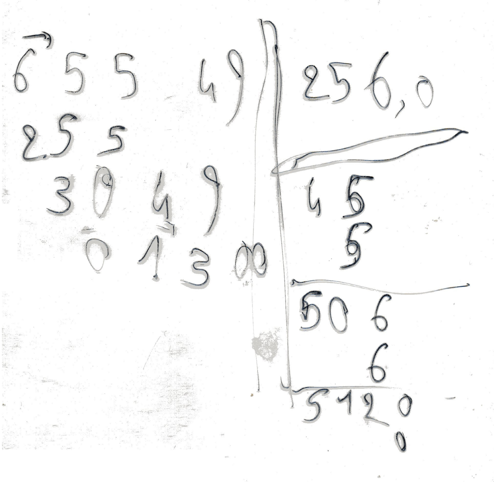

-*- encoding: utf-8; indent-tabs-mode: nil -*-

Introduction
============

The  purpose  of  the  module is  simulating  the  basic  arithmetical
operations as  executed by a human  equipped with nothing more  than a
few sheets of paper and a pencil.

History
=======

During  the 1960's  (extending into  the 1970's),  I learned  the four
basic operations, addition, subtraction, multiplication and division.


In 1976, I learned square root computation, with a method very similar
to the standard "gallows" method for the division.

```
200000000|14142
100      |-----
 0400    |24
  11900  | 4
   060400|---
    03936|281
         |  1
         |----
         |2824
         |   4
         |-----
         |28282
         |    2
         |
```

In 1979, my  father was given a copy of  an arithmetics exercise book,
used in 1822. This exercise  book contained divisions much unlike what
my father  and I knew.  I did some reverse  engineering and I  think I
found  the method  that  was  used. Yet,  this  is  nothing more  than
guesswork.


The first two divisions is the page above are 2469600 divided by 25882
gives 954, remainder  13170 and 34048000 divided by  25882 gives 1315,
remainder 13170. These divisions are part  of the rules of three (7000
×  3528) /  25882 and  (7000 ×  4864) /  25882.  By  the way,  you may
recognise the corresponding  multiplications in the page,  next to the
divisions. The  divisions are reproduced  below, but without  the fact
that many digits are striken nor the fact that the remainders 4572 and
13170 are underlined with an slant line.

```
   04                 13
  1085               1421
 140217             040187
24696202           08166480
24696000{0954      34048000{1315
--------           --------
25882222           25882222
 258888             258888
  2588               2588
   25                 25
```

In 1982, for  a science history project, I borrowed  _Number Words and
Number Symbols, A Cultural History of Numbers_, from Karl Menninger, I
read it and I gave it back to the library.

In 1996, I bought and I  read _Histoire d'Algorithmes, du caillou à la
puce_.

In 2000  or 2001, I  wrote a Perl programme  to compute a  square root
with the  "gallows" method. There  are no back-ups of  this programme,
which is a good thing.

In 2005, during the
[French Perl Workshop in Marseille](https://journeesperl.fr/fpw2005/)
I gave a lightning talk about
[square root computation](https://journeesperl.fr/fpw2005/talk/201).
The  demo used  a marker  (instead of  a pencil)  and a  rhodoid sheet
(instead  of paper),  but no  computer  and no  programme. The  future
programme was  announced for "some  time in  the future". Here  is the
rhodoid sheet from this lightning talk.



```
6554900|256,0
255    |-----
 3049  |45
  01300| 5
       |--
       |506
       |  6
       |---
       |5120
       |   0
```

In  2009, I  bought a  copy  of _Number  Words and  Number Symbols,  A
Cultural  History of  Numbers_  and I  could read  it  and consult  it
without bothering about library late fees.

In 2023,  I began  working on  the programme I  had promised  in 2005,
although this will not be a Perl programme, but a Raku module.

Purpose
=======

A computation is a two-tier process. Let us consider a multiplication.
The first  tier is mental computation,  in which the child  is able to
multiply two single-digit numbers and get a 1- or 2-digit number.  And
the  second tier  is paper-and-pencil  computing, in  which the  child
writes  in  an  organised  way  the  partial  results  of  the  mental
computations, to execute  a full multiplication of  a _n_-digit number
by a _n'_-digit number.

The module  has two main classes.  The first one is  the number class,
which simulates mental computation and  in which operations  have very
strict limits.  For example,  multiplication in  allowed only  if both
factors are single-digits numbers.

The  second  main  class  simulates  a   sheet  of  paper  (or  a  few
sheets). The  main attribute of  this class is  a list of  actions, to
simulate the child reading some already written digits, doing a mental
computation, and  writing the result on  the sheet , while  saying the
proper formulas such as:

```
  6 fois 8, 48
  je pose 8 et je retiens 4
```

(sorry, I only know the french version).

The  class  includes several  methods  for  the  various  arithmetical
operations, addition, subtraction, multiplication, division and square
root.  These  methods feed  the "list  of actions"  attribute. Another
method reads this list of actions  and renders them as HTML. Depending
on the method  parameters, the HTML text can contain  only the written
part of the operation, or it can include in addition the formulas said
by the simulated human.

Future versions of the module may include other rendering formats such
as plain text  or L<sup>A</sup>T<sub>E</sub>X + Metapost.  But this is
deep in the to-do stack.

What the module will not do
---------------------------

When I was 10, I knew a few things that will not appear in the module.
For example, I learned (and I  still know) how to compute with numbers
with   a   fractional  part.   The   module   will  deal   only   with
integers. Dealing  with the decimal  point would need  many additional
programme lines for  a limited benefit.  So, my 2005  demo will not be
possible with the module.  Either  the computation stops after dealing
with the units  digits, or the module user bypasses  the limitation by
asking  the square  root  of  6554900 and  by  manually inserting  the
decimal point.  Likewise, if you want  to compute π with  6 fractional
digits using the  well-known fraction 355/113, you  will have actually
to compute 355_000_000 / 113 and insert a decimal point just after the
leftmost digit.

Another  point. When  dividing  two numbers,  finding each  successive
digits for the  quotient is a trial-and-error process.  Let us suppose
we want to divide 654000 by 1852. For the mental division, we focus on
the first digit of  both dividend and divisor, in this  case, 6 and 1.
So the first candidate digit of the quotient is 6. Then I would try to
compute the partial remainder and I would find that 6 is too big. So I
would try a second time with 5 and  it would still be too big. Then 4,
then 3, which would eventually  succeed. This was basic training, when
I was maybe 8.  Then, when I turned 10, I learned that  I should get a
look at the second digit of the divisor.  If this digit is a 9 or even
a 8, you  can compute the first candidate by  dividing the first digit
of the  dividend by the  first digit of the  divisor _plus 1_,  In the
case of 65400 and 1852, you would divide 6 by 2 and obtain directly 3.
My module does not do this. Yet,  there is a "cheat" mode in which the
module hides the attempts  with 6, 5 and 4 and  shows only the attempt
with 3. This gives the following:

```
  En 6, combien de fois 1, il y va 6 fois.
  Mais je triche et j'essaie directement 3. (tr: but I cheat and I immediately try 3)
```

Actually, it  is nearly the same,  except that my module  executes all
the computations, even  if they are discarded.  Another difference, as
shown with the  division of 74500 by 1852 is  that the first candidate
is 7/2 = 3, which is too small,  the first digit of the quotient is 4.
The module tries  7, 6, 5 and  then 4, without considering  3 which is
too   low.  Thus,   the  module   only  checks   "too-bigness",  never
"too-smallness".

Do  we require  a  plus sign  (or  several)  on the  left  side of  an
addition? A minus sign on the left side of a subtraction? A times sign
on the left  side of a multiplication?  This is what I  learned at the
very beginning  of my arithmetic  lessons, but soon it  was discarded.
From  time  to time,  I  would  write a  times  sign,  but usually  my
multiplications would have  no signs. The module will  not print these
signs.   An   exception:    the   radix-to-radix   conversions   stack
multiplications  on  top   of  additions  and  additions   on  top  of
multiplications. To  improve readability,  the module will  print plus
and times signs when appropriate.

The  module uses  only indo-arabo-latin  numerals (0,  1, 2,  3, etc).
There is no plan to use indo-arab numerals (٠ for 0, ١ for 1, ٢ for 2,
٣  for 3,  ٤ for  4, etc)  nor chinese  numerals nor  other positional
number systems.  Even more,  the additional systems  (egyptian, roman)
are not dealt with.

A sufficiently experienced human (my younger  self at 10 year old, for
example,   but  not   8  year   old)  understands   that  under   some
circumstances, some shortcuts are possible,  such as when a multiplier
or a  multiplicand has many  zeroes. My  module will not  detect these
conditions.   It will  apply the  rules  in a  dumb way,  even if  the
dumbness mutates into silliness.

My module can be considered as  an alternative solution for a `bigint`
module. This  is true as long  as we do not  consider performances. An
actual  `bigint`  module  give  efficient  computation  with  extended
precision.  My  module aims  at  extended  precision computation  with
traceable steps.

Not  only the  module lacks  efficiency, but  it also  lacks ergonomy.
suppose we  want to compute  `√(b² - 4ac)`. We  would need to  write a
programme in this fashion:

```
my Arithmetic::PaperAndPencil::Number $a;
my Arithmetic::PaperAndPencil::Number $b;
my Arithmetic::PaperAndPencil::Number $c;
# initialisation of a, b and c, to be completed
...
# end of initialisation, beginning of computation
my Arithmetic::PaperAndPencil::Number $four .= new(value => '4');
my Arithmetic::PaperAndPencil::Number $result;

my Arithmetic::PaperAndPencil $sheet .= new;
$result = $sheet.squareroot($sheet.subtraction($sheet.multiplication($b, $b), $sheet.multiplication($four, $sheet.multiplication($a, $c))))
```

And  the example  above is  much  simplified. The  parameters for  the
methods are shown  as positional parameters, yet  the methods actually
require keyword parameters.

A last  point in which my  module agrees with my  training is carries.
When I  was taught arithmetics, I  learned to keep carries  in my mind
and not write them. My module will  do the same, it will not print the
carries.

What the module will do
-----------------------

When I was 10 years old, I did not know how to compute square roots, I
did not know the 1822 (or rhombic)  variant of the division, I did not
know the  others variants of  multiplication and division.  The module
will provide all these.

Most human  beings can  compute in  radix 10  only. Some  have limited
skill  to  compute  in  octal   or  hexadecimal.  My  module  will  do
computations in any  radix from 2 to 36. Thus,  the mental computation
class will be able to compute Z × Z  = Y1 in radix 36 (in radix 10: 35
× 35 = 1225 = 36 × 34 + 1).

When I learned  number bases, I learned to convert  numbers from radix
10 to radix  _b_ with cascading divisions and to  convert numbers from
radix _b_ to  radix 10 by computing a polynomial  with Horner's scheme
(I did not know Horner's scheme, I even did not know what a polynomial
was, but nevertheless, I knew how to do this kind of computation). But
I did  not learn how  to convert a number  directly from radix  _b_ to
radix _b'_. Later,  I discovered the special cases  of converting from
radix 2 to radix  4, 8 or 16 or the inverse  conversions, which are in
fact very  simple. But I still  cannot convert a number  directly from
radix _b_ to radix  _b'_ in the general case. The  module will be able
to do such a conversion for any couple of bases from 2 to 36.

The numbers  processed by the  module have  no limits. Or  rather, the
limits come from the Raku interpreter  and from the host computer. So,
you can reproduce
[Frank Nelson Cole](https://en.wikipedia.org/wiki/Frank_Nelson_Cole)'s
multiplication, when he showed in 1903 the prime factors for the
[67th Mersenne number.](https://en.m.wikipedia.org/wiki/Mersenne_prime).
When  I  was  10  years  old, I  theoretically  could  compute  Cole's
multiplication, but actually I would have  made errors or I would have
given up before it was complete.

When  I   learned  multiplications   and  divisions,  I   learned  the
French-speaking formulas  which support these operations,  e.g. "En 6,
combien de fois  1, il y va 6  fois." I do not know  the equivalent in
foreign   languages.  Yet,   the  module   includes  a   multi-lingual
mechanism. So,  if I get  help from a  native English speaker,  from a
native German speaker, and so on, the module will be able to write the
formulas in English, or in German, or in some other language.

Some confusing matter
---------------------

The numbers manipulated by the module belong to two different species.
The first species contains the  numbers targetted by the computations:
multiplicands, multipliers,  partial products, and  so on, as  well as
pieces of these numbers: unit  digits, carries, etc. These numbers are
instances of the `Arithmetic::PaperAndPencil::Number` class. And there
are auxiliary numbers: counting the elements  in an array or the chars
in a  string, or  the numeric radices,  line numbers,  column numbers,
which are used to help construct  the full operations. The numbers are
plain Raku `Int` values and they  are immune from the limits of mental
computations, such as preventing the  multiplication of two numbers if
one of them is a multi-digit number.

Operations
==========

Addition
--------

No variants, no special cases. Nothing to say.

Subtraction
-----------

The subtraction is  a "reverse" addition, so there is  no variants, no
special cases  and nothing to say?  On the contrary. We  must consider
separately the  stand-alone subtraction  and the  embedded subtraction
(computing the partial remainder in  a division). Also, while there is
no  variants for  the  addition,  there is  one  for subtraction,  the
variant using the  _b_-complement, as we learn when  we study assembly
programming (2-complement or 16-complement).

### Stand-alone subtraction

A subtraction  needs a single  phase. Yet, if the  substracted numbers
are very different,  we can distinguish up to three  subphases. Let us
consider this subtraction.

```
123450000012345
-       8867700
---------------
```

The first subphase is processing each  digit from the low number. This
is what we think about when talking about a subtraction.


```
123450000012345
-       8867700
---------------
        1144645
```

There is no more digits in the low number, but there is still a carry.
The second subphase is the processing of this carry.

```
123450000012345
-       8867700
---------------
    49991144645
```

Now, there  is neither a  carry nor a digit  from the low  number. The
third  subphase is  just copying  the remaining  digits from  the high
number to the result.

```
123450000012345
-       8867700
---------------
123449991144645
```

In  some cases,  the second  subphase and  the third  subphase can  be
missing. This is the case with  subtractions embedded in a division or
a square  root extraction to  compute a partial remainder.  The second
subphase will involve  at most one digit from the  high number and the
third subphase will be totally absent.

### Embedded subtraction

Let us use the following division as an example.

```
---
9212|139
    |---
    |6
```

When  the pupil  computes  the intermediate  remainder,  he starts  by
computing  "6  time  9  is  54", then  he  compares  this  value  with
single-digit 1. The  pupil then says "from 61, it  remains 7" (or some
sentence with the same meaning, I am not a native English speaker) and
then "write 7, carry 6".

What happens? The input data to the subtraction are:

* a high number, with a single digit (1 in this example),

* a low number, with one or two digits (54 in this example).

The output data are:

* the  _adjusted_ high  number, with  usually two  digits (61  in this
example),

* the subtraction result, a single-digit number (7 in this example).

This process is  a mental process, without writing. So  it is coded in
the  `Arithmetic::PaperAndPencil::Number` class.  It  is  used in  the
division, but also in the  stand-alone subtraction (where we know that
the carry can never be more than `1`).

A side remark. When  I learned in my early years, I  was taught to say
(very roughly translated) "6 times 9,  54, plus 7, 61", while in other
schools other children would say "6 times 9, 54, from 61, remain 7". I
did not  understand why this  addition-like sentence in my  school was
better than the  subtraction-like sentence in other  schools and after
all these years  I still do not  understand. Yet my brain  is wired in
this way, so  this is the way the spoken  sentences are implemented in
French. In other languages, I will trust whoever helps me.

### _b_ complement subtraction

This  variant  is  used  for  the fractional  part  (or  mantissa)  of
logarithms and for subtraction in radix 2 and radix 16. Yet, it can be
used with integers in any radix and  I will give an example in decimal
with the 10-complement. Let us use the same example as above.

```
123450000012345
-       8867700
---------------
```

To compute the difference, we  must first compute the 10-complement of
the low  number (10-complement because  of radix 10).  Actually, there
are several  possible 10-complements for  the same number,  because we
did not specify the required length. If you compute logarithms using a
5-digit log  table, or if  you write  assembly programmes on  a 16-bit
computer, the  length of the  10-complement or of the  2-complement is
implied, so the question is not necessary. Here, since the high number
has 15 digits, we need the 15-long 10-complement of 8866700. There are
two ways to compute this number.

First way: we adjust the length of  the low number by adding zeroes to
the left, to reach the required length (15 in this example).

```
        8867700
000000008867700
```

We  scan the  digits right-to-left.  While these  digits are  zero, we
leave them unchanged.

```
000000008867700
             00
```

The  next  digit,  and  only  this next  digit,  is  replaced  by  its
10-complement. In the example, 7 turns to 3.

```
000000008867700
            300
```

Lastly,  all  other  digits  are replaced  with  their  9-complements,
including the  zeroes that  would still  be there.  In the  example, 7
turns to 2, 6 turns to 3, 8 turns to 1 and 0 turns to 9.

```
000000008867700
999999991132300
```

Second way to  compute the 10-complement: we adjust the  length of the
low number by adding zeroes to the left, to reach the required length.

```
        8867700
000000008867700
```

We replace all digits by their 9-complements.

```
000000008867700
999999991132299
```

We add 1.

```
000000008867700
999999991132299
              1
---------------
999999991132300
```

Once we  have the  10-complement of  the low  number, with  either the
first or second method, we add it to the high number.

```
 123450000012345
 999999991132300
----------------
1123449991144645
```

There is  always a new digit  (a sixteenth digit in  this example) and
this additional digit is always 1. We discard this digit and we obtain
the result of the subtraction, 1123449991144645.

Of  course,  when   using  binary  we  talk   about  1-complement  and
2-complement.  In hexadecimal,  we  may talk  about 15-complement  (or
F-complement) and  16-complement. But since radix  16 is, in a  way, a
"higher-level   view"  of   radix   2,  many   people  still   mention
1-complements and 2-complements.

Multiplication
--------------

### Standard

The standard multiplication is well-known:

```
   628
   234
  ----
  2512
 1884.
1256..
------
146952
```

Is  there  something  to  add?  Yes. This  standard  variant  has  two
sub-variants. The first variant is the "with short-cuts" variant.  Let
us consider the multiplication of  628 by 333. The vanilla sub-variant
executes the same computation three times:

```
3 fois 8, 24, je pose 4 et je retiens 2
3 fois 2, 6, et 2, 8, je pose 8 et je ne retiens rien
3 fois 6, 18, je pose 18

   628
   333
  ----
  1884

3 fois 8, 24, je pose 4 et je retiens 2
3 fois 2, 6, et 2, 8, je pose 8 et je ne retiens rien
3 fois 6, 18, je pose 18

   628
   333
  ----
  1884
 1884.

3 fois 8, 24, je pose 4 et je retiens 2
3 fois 2, 6, et 2, 8, je pose 8 et je ne retiens rien
3 fois 6, 18, je pose 18

   628
   333
  ----
  1884
 1884.
1884..
```

The "with shortcuts"  variant executes the computation  only once. The
second and third partial products are just copies of the first one:

```
3 fois 8, 24, je pose 4 et je retiens 2
3 fois 2, 6, et 2, 8, je pose 8 et je ne retiens rien
3 fois 6, 18, je pose 18

   628
   333
  ----
  1884

Je recopie la ligne 1884 (= "copying line 1884")

   628
   333
  ----
  1884
 1884.

Je recopie la ligne 1884 (= "copying line 1884")

   628
   333
  ----
  1884
 1884.
1884..
```

The other sub-variant is an hypothetical one. Or rather, I never heard
about  it. It  is an  extension  to multiplication  of the  "prepared"
sub-variant of  the division.  On a  first sheet  of paper,  the pupil
lists the multiples  of the multiplicand.  For  the prepared division,
the list goes up to "9 × 628", but for the prepared multiplication, we
can stop at "4 × 628", because the multiplier has no digit higher than
4. Then, the second sheet of paper has no mental multiplications, only
copies of existing lines:

```
1 times 628,  628
2 times 628, 1256
3 times 628, 1884
4 times 628, 2512
Next Page

   628
   234
  ----

Copying line 2512

   628
   234
  ----
  2512

Copying line 1884

   628
   234
  ----
  2512
 1884.

Copying line 1256

   628
   234
  ----
  2512
 1884.
1256..
```

The last phase, adding the partial  products, is not shown, because it
is the same for the three sub-variants.

### Rectangular variant

Let us go back to multiplying 628 by 234, which gives 146 952.  In the
picture  below,  the  multiplicand  is   on  a  blue  background,  the
multiplier is on a green background and the final product is on a pink
background. These  colours play no  role in the  multiplication, their
purpose is only to streamline the explanations in this chapter.

Long before reading _Histoire d'algorithmes_ (_HAL_) and _Number Words
and Number Symbols_ (_NWNS_), I  had heard about a rectangular variant
for multiplications. It was shaped like the A1 example below.


In  _NWNS_ page  442, the  author gives  an example  of multiplication
using indo-arabo-latin digits  (0, 1, 2, etc) following  format A2 and
the same example with  indo-arab digits (٠ for 0, ١ for 1,  ٢ for 2, ٣
for  3, etc)  following format  B3, obviously  attempting to  cram the
whole product on the bottom line.

In _HAL_,  the examples  begin on  page 28,  with a  multiplication in
which  the rectangle  sides  form  an angle  of  45  degrees with  the
horizontal  or with  the vertical.  Moreover, the  number are  written
right-to-left in radix 60 (seconds, then minutes, then degrees, if you
read left-to-right)  and. On page  30, you find a  multiplication with
chinese  digits  and  following  pattern  A2. It  comes  from  a  1450
manuscript, _Jiunzhang suanfa  bilei daquan_. On page 32,  there are a
A2 multiplication and  a B1 multiplication from  an anonymous treatise
published  in Trevise  in  1478, and  a B2  multiplication  and an  A2
multiplication from a treatise written by Luca Pacioli in 1494.

Multiplication A1  is too cumbersome. Multiplication  B1 is confusing,
with the  multiplier stuck to  the last  part of the  product. Lastly,
multiplication B3 is  barely legible, it does not  help understand the
mechanism of  multiplication (you cannot  easily guess how  to compute
the units  and the tens  of the product)  and it is  incompatible with
`Int` typed  line numbers  and column  numbers.So the  module provides
only the A2 and B2 variants, renamed `rectA` and `rectB`. In addition,
the module does not draw inner vertical and horizontal lines. It looks
like:

```
   6 2 8             6 2 8
  --------         --------
 1|1/0/1/|         |\4\8\2|2
  |/2/4/6|2       4|2\0\3\|
 4|1/0/2/|         |\8\6\4|5
  |/8/6/4|3       3|1\0\2\|
 6|2/0/3/|         |\2\4\6|9
  |/4/8/2|4       2|1\0\1\|
  --------         --------
   9 5 2             1 4 6
```

A minor difference  with the final result: in  this Markdown document,
horizontal lines  appear as strings  of dashes.  In the  HTML version,
the  horizontal lines  will  be  generated by  `<u>`  tags to  display
underlined spaces  or underlined digits.  On the other  hand, vertical
and slant lines are drawn with pipes / slashes / backslashes as shown.

### Rhombic variant

This variant is described in _NWNS_ on  page 440. It is similar to the
rhombic variant of  the division, which is the reason  why I gave them
the same name.

Karl Menninger begins with describing  the idea, regardless of the way
the  digits are  placed  on the  paper  sheet. Let  us  use again  the
multiplication 234 ×  628. The first step in the  computation of 234 ×
6. this gives:

```
  24
 18
12
------
   628
------
 234
```

The second step is 234 × 2, with the multiplier written a second time,
aligned with digit "2" of the multiplicand:

```
   08
  06
 04
------
  24
 18
12
------
   628
------
 234
  234
```

The third step is 234 × 8, with the multiplier aligned with digit "8":

```
    32
   24
  16
------
   08
  06
 04
------
  24
 18
12
------
   628
------
 234
  234
   234
```

Lastly, the partial products are added together:

```
146952
------
    32
   24
  16
------
   08
  06
 04
------
  24
 18
12
------
   628
------
 234
  234
   234
```

This is the theoretical side. Actually, the multuplication is executed
by wrting each  partial product digit in the first  available sport in
the  proper  column. And  leading  zeroes  are  not written.  Here  is
side-by-side the theoretical view with  leading zeroes removed and the
actual view.

```
  24
 18         12
12         1284
------     ------
   628        628
------     ------
 234        234
```

Second step.

```
    8
   6
  4
------
  24         4
 18         126
12         12848
------     ------
   628        628
------     ------
 234        2344
  234        23
```

Troisième étape.

```
    32
   24
  16
------
    8
   6
  4
------       12
  24         463
 18         1264
12         128482
------     ------
   628        628
------     ------
 234        23444
  234        233
   234        2
```

And  the addition  of the  partial products.  In the  text below,  the
digits from the  partial products should be striken,  leaving only the
final product digits as readable digits.

```
  146952
  ------
      32
     24
    16
  ------
      8
     6
    4          69
  ------       125
    24        4463
   18        112642
  12         128482
  ------     ------
     628        628
  ------     ------
   234        23444
    234        233
     234        2
```

Implementation
==============

Coordinates
-----------

Coordinates are line numbers and  column numbers. The variation is the
usual one, line numbers increase from top to bottom and column numbers
increase  from left  to  right.  In some  cases,  it  is difficult  to
determine   the   final   footprint    of   the   operation   (rhombic
multiplication, for example).  So we allow negative  coordinates if we
need to insert a  new line above the operation of a  new column on the
left of the operation.

This  lead  us to  the  distinction  between logical  coordinates  and
physical coordinates. The HTML  renderer uses physical l-c coordinates
which are  always positive  or zero. The  coordinates computed  by the
various operation  generators are  logical coordinates. Each  time the
HTML renderer displays the operation,  it checks the minimum values of
the l-c numbers to determine how  to shift the logical coordinates and
obtain physical coordinates.

Another shift between physical and  logical coordinates comes from the
vertical lines. Vertical  lines are rendered as  pipe characters. They
are full-fledged characters, when  compared with horizontal lines that
are rendered  as "underline"  attributes. This means  that we  need to
allocate a physical column for vertical lines.

Example (with the proviso that  I could not use "underline" attributes
in a Markdown document and `31` should  be on the same line as `0160`;
the line coordinates in this example are not significant):

```
+--------------- logical = -8, physical =  0
|       +------- logical =  0, physical =  8
|       |+------ logical =  0, physical =  9
|       ||+----- logical =  1, physical = 10
|       ||| +--- logical =  3, physical = 12

355000000|133
0160     |---
 057     |31
```

For a multi-character  string, the coordinates are  the coordinates of
the  last character  (usually  the units  digit, if  the  string is  a
number). In the example above, logical coordinates of the dividend are
`l=0, c=0` and the logical coordinates  of the divisor are `l=0, c=3`.
For a  vertical line,  the logical  column number is  the same  as the
column number of the left neighbour character. For an horizontal line,
the  logical  line number  is  the  same as  the  line  number of  the
underlined character.

Paper Sheet
-----------

The main class, `Arithmetic::PaperAndPencil`, represents a paper sheet
(or two, for a prepared division).  For the moment, the only attribute
is    a    list    of    actions,    from    the    auxiliary    class
`Arithmetic::PaperAndPencil::Action` described below.

Actions
-------

An action usually consists in:

1. read one or two already written digits,

2. possibly strike them,

3. do a mental computation with these two digits,

4. say the formula associated with this computation,

5. write the result on the sheet of paper.

Sometimes, an action is just  drawing a line, without saying anything.
Or it  consists in copying several  contiguous digits from a  place to
another  (multiplications with  shortcuts or  prepared divisions).  Or
erasing contiguous digits.

The attributes  of class  `Arithmetic::PaperAndPencil::Action` are:

* `level` a level described in the following chapter.

* `label` code of the spoken formula accompanying some computations or some actions

* `val1`, `val2`, `val3` variable values interpolated in the spoken formula.

* `r1l` and `r1c` logical coordinates of the first read digit.

* `r1val` value of the first read digit.

* `r1str` boolean indicating if the digit is striken or not.

* `r2l`, `r2c`, `r2val`, `r2str` the equivalent for the second read digit.

* `w1l`, `w1c`, `w1val` the equivalent for the first written digit.

* `w2l`, `w2c`, `w2val` the equivalent for the second written digit.

Example for the following action:

```
        c → 0 123456 7     0 123456 7

l → 0         6 2 8          6 2 8
             --------       --------
    1        | / / /|       |1/ / /|
    2        |/ / / |2      |/2/ / |2
    3        | / / /|    →  | / / /|
    4        |/ / / |3      |/ / / |3
    5        | / / /|       | / / /|
    6        |/ / / |4      |/ / / |4
             --------       --------
    7
```

The corresponding action contains:

* `level = 5` (see below)

* `label = MUL01` code for message "#1# fois #2#, #3#" (or "#1# times #2#, #3#")

* `val1 = 6`, `val2 = 2`, `val3 = 12` for the final message "6 fois 2, 12" (or "6 times 2, 12")

* `r1l = 0`, `r1c = 1`, `r1val = 6`, `r1str = False`

* `r2l = 2`, `r2c = 7`, `r1val = 2`, `r1str = False`

* `w1l = 1`, `w1c = 1`, `w1val = 1`

* `w2l = 2`, `w2c = 2`, `w2val = 2`

Second example with a full string instead of single digits:

```
        c → 0123456      0123456 7

l → 1          628          628
    2          333   →      333
              ----         ----
    3         1884         1884
    4            .        1884.
```

The corresponding action contains:

* `level = 3` (see below)

* `label = WR05` code for "Je recopie la ligne #1#" (or "Copying line #1#")

* `val1 = 1884` for final message "Je recopie la ligne 1884" (or "Copying line 1884")

* `w1l = 4`, `w1c = 4`, `w1val = 1884`, the column is the column of the last digit.

* other attributes: whatever

When a line  is drawn, the code starts with  `DR` for "draw". Usually,
this does not correspond to an actual message, because we are not used
to say anything when drawing the line. The coordinates of the starting
and stopping locations  are stored into `w1l`, `w1c`,  `w2l` et `w2c`.
Example:

```
        c → 0 123456 7     0 123456 7

l → 0         6 2 8          6 2 8
             --------       --------
    1        |      |       |     /|
    2        |      |2      |    / |2
    3        |      |    →  |   /  |
    4        |      |3      |  /   |3
    5        |      |       | /    |
    6        |      |4      |/     |4
             --------       --------
    7
```

* `level = 5` (see below)

* `label = DRA04` code for an slant line

* `w1l = 1`, `w1c = 6`

* `w2l = 6`, `w2c = 1`

* other attributes: whatever

### Attribute `level`

The  attribute  `level` controls  the  time  when the  HTML  procedure
actually renders the partially written operaton. The higher the value,
the more frequent the operation is rendered. The typical values are:

* 0 display the operation only when complete.

* 1  display the  operation each  time the  page change  (for prepared
multiplications and prepared divisions).

* 2 display when changing phase.  E.g., for multiplications, there are
three  phases:  set-up, computing  the  partial  products, adding  the
partial products to compute the final product.

* 3  full processing  of  a digit.  E.g. for  divisions,  this is  the
computation of  a new  valid quotient  number, with  the corresponding
partial remainder. Since this ia a trial-and-error mechanism, only the
last successful trial is level-3.

* 4 for the operation with a trial-and-error process such as division,
this level correspond to the full processing of a fruitless value.

* 5 for the writing of each digit of a partial product or of a partial
remainder.

* 6 intermediate computation, without writing.

In the  case of the  conversion for a  radix to another  with Horner's
schema, the complete operation  includes several basic multiplications
alternating with basic additions.  The levels of these multiplications
and additions are shifted when  compared with the level of stand-alone
multiplications and additions. For example, level 2 for the transition
of phase becomes level  5, level 3 for the full  processing of a digit
of the multipler becomes level 6 and so on.

For  a given  action, the  level is  function of  this action,  but it
depends also of the next action. For example, most `WRI01` actions are
level 5,  but if this action  is the last, or  if it is followed  by a
`TITnn` action, the level of the `WRI01` action is 0.

### Special Action Codes

These codes are not directly linked to an arithmetical operation. They
are utility functions.

| Code  | Explanation                        |
|-------|:-----------------------------------|
| DRA01 | Vertical line                      |
| DRA02 | Horizontal line                    |
| DRA03 | Slant line, shown as backslashes   |
| DRA04 | Slant line, shown as slashes       |
| ERA01 | Erasing characters                 |
| HOO01 | Hook over a dividend               |
| NXP01 | Changing page                      |
| TITnn | Title for an operation             |

Why four  different codes  for drawing  lines? It  would be  better to
deduce the orientation of the  line by checking the coordinate values,
wouldn't it? For example, if `w1c == w2c`, that means that the line is
vertical, if  `w1l ==  w2l`, it  is horizontal. The  answer is  no, we
cannot  just compare  the  coordinates.  There is  the  case of  lines
occupying a single cell. For  those lines, we have simultaneously `w1c
== w2c`, `w1l == w2l`, `w1c - w2c ==  w1l - w2l` and `w1c - w2c == w2l - w1l`,
so we  cannot infer  the line  angle from  the coordinates,  we cannot
determine if we must  write a single pipe, a single  slash or a single
backslash or if we tag a single digit with an underline HTML tag.

The hook over a dividend is a way to remember the column-coordinate of
the first intermediary remainder during a division. At first, I wanted
to  use `U+0305`  (`COMBINING  OVERLINE`), but  my  attempts were  not
successful. So I made this a variant of `DRA02`.

Ideas I gave up
===============

Dropped Functionnalities
------------------------

### Fractional parts

At the very  beginning, I wanted to include numbers  with a fractional
part. Then I realised that would need many additional programme lines,
for a small benefit. So all the numbers this module uses are integers.

### Abacus

For some time,  I hoped to include the abacus  methods (_Suan Pan_ and
_Soroban_). The  visualisation function would need  a complete rewrite
and the computation methods would actually have few common points with
the paper methods,  so I discarded this idea. If  necessary, this will
be in another module, most certainly written by someone else.

### Other arithmetic operations

The  primary goal  of  this  module was  to  present  the square  root
extraction. It  was obvious that the  module would need also  the four
basic operations: addition,  subtraction, multiplication and division.
We  may consider  other  computation methods,  such  as prime  factors
extractions,  conversion  from  a  radix to  another  (either  with  a
polynomial  calculation  using  Horner's  scheme,  or  with  cascading
divisions), GCD extraction (with  cascading divisions, a.k.a. Euclid's
algorithm). I  discarded the prime  factors extraction and I  kept the
radix  conversion with  Horner's scheme.  For the  cascading divisions
methods (radix conversion and Euclid), I have not decided yet.

For what it's worth, here is the prime factors extraction for 28:

```
28 | 2
14 | 2
 7 | 7
 1 |
```

What is missing in this example is that on other sheets of papers, you
have  28 divided  by  2, 14  divided  by 2,  7 divided  by  2 (with  a
remainder), 7  divided by 3  (also with a  remainder), 7 divided  by 5
(still a remainder) and 7 divided  by 7 (and no remainder). Because of
all these  new pages, the  display is  cumbersome, so I  discarded the
idea.

### Numeric bases 37 and beyond

I  adopted a  limit with  radix 36  because the  alphabet provides  26
letters that can be added to the  10 usual digits. We cannot go beyond
while keeping this system. Yet, there are two important numeric bases,
which are radix 60 (for the time  of day and for angles) and radix 256
(for IPv4 addresses, among others). I  had already written a big chunk
of  the module  when I  remembered there  are ways  to write  radix-60
numbers and radix-256 numbers while using the digits 0 to 9 and little
more: the  dotted notation  and the  "decimal-coded" notation  (not an
official    designation,   based    on   the    well-known   BCD    or
"binary-coded-decimal").

| domain  | radix 10   | dotted notation | decimal-coded |
|:--------|-----------:|:---------------:|--------------:|
| time    | 71120      |  19:45:20       | 194520        |
| time    | 68585      |  19:3:5         | 190305        |
| IPv4    | 2130706433 | 127.0.0.1       | 127000000001  |
| IPv4    | 3232235777 | 192.168.1.1     | 192168001001  |

As you  can see, the dotted  notation generally uses a  dot separator,
but it may  use another separator, such  as the colon for  the time of
day.  Also,  you  may  have  been susprised  by  the  "radix  10"  and
"decimal-coded" notations of the IPv4 address. The "radix 10" notation
is a perfectly valid one, even if  it is seldom used. While under your
web browser, you can open  the address `http://3232235777` and it will
work. Or  you can ping  address `2130706433`.  On the other  hand, the
"decimal-coded" notation is never used, but  it could be, if we find a
way to remove the confusion with the "radix 10" notation.

I have also discarded variants  of the numeric positional systems. For
example mixed-radix systems,  such as the `20-18`  mixed-radix used in
the long  count of the  Maya calendar, or the  factorial-radix system,
shown in
[xkcd](https://xkcd.com/2835/).
There  is also  the  `i-1` number  system, created  by  W. Penney  and
explained  by  D.E.  Knuth  in  chapter 4  of  _The  Art  of  Computer
Programming_ (pages 189  and 190), which uses only digits  `0` and `1`
and yet, covers  all the complex numbers with integer coordinates, not
only the  ray of positive numbers.  And there is the  balanced ternary
system, a system with radix 3, but instead of digits `0`, `1` and `2`,
this system  uses digits `0`,  `1` and "`1`-overbar", with  a negative
value. This system is presented by D.E. Knuth on pages 190 to 192.

Discarded implementations
-------------------------

### Layout of the `Arithmetic::PaperAndPencil::Action` class

Let us consider again the action used as an example above:

```
        c → 0 123456 7     0 123456 7

l → 0         6 2 8          6 2 8
             --------       --------
    1        | / / /|       |1/ / /|
    2        |/ / / |2      |/2/ / |2
    3        | / / /|    →  | / / /|
    4        |/ / / |3      |/ / / |3
    5        | / / /|       | / / /|
    6        |/ / / |4      |/ / / |4
             --------       --------
    7
```

The corresponding action contains:

* `level = 5`

* `label = MUL01` code for message "#1# fois #2#, #3#" (or "#1# times #2#, #3#")

* `val1 = 6`, `val2 = 2`, `val3 = 12` for the final message "6 fois 2, 12" (or "6 times 2, 12")

* `r1l = 0`, `r1c = 1`, `r1val = 6`, `r1str = False`

* `r2l = 2`, `r2c = 7`, `r1val = 2`, `r1str = False`

* `w1l = 1`, `w1c = 1`, `w1val = 1`

* `w2l = 2`, `w2c = 2`, `w2val = 2`

At first, my intention was to create five different instances
of object `A::PP::Action`:

1. read digit 6 of the multiplicand (`level = 6`),

2. read digit 2 of the multiplier (`level = 6`),

3. say message "6 fois 2, 12" (`level = 6`),

4. write digit 1 of the partial product (`level = 6`),

5. write digit 2 of the partial product (`level = 5`),

Each object instance would contain  a single line coordinate, a single
column  coordinate and,  except  for the  spoken  message instance,  a
single  value. The  instances  would have  different  labels, such  as
`WRI00` (which actually exists) for  write-instances and a new `REA00`
for read-instances.

Eventually, I put everything into the  same object instance and I feel
it is  better. There  is still  a case where  there are  two instances
instead of one.  When I conclude a  computation with "Je pose  2 et je
retiens 1", there is a first  instance with the computation message "6
fois 2,  12" and  the reading  of digits, and  a second  instance with
message "Je pose..." and the writing of the new digits.

### Databases

Instead of using  RAM objects and classes, I considered  for some time
using SQL  tables. But this  would have added pointless  problems with
infrastructure and logistics.

### Output formats

I considered  other output formats,  in addition to HTML:  plain text,
L<sup>A</sup>T<sub>E</sub>X + Metapost, and even curses or Gimp. I may
code the L<sup>A</sup>T<sub>E</sub>X + Metapost output format, but the
others are not in the to-do list.

### Zigzag addition

The standard addition involves right-aligned numbers, that is, number
aligned according to the unit digits. Example:

```
   2512
   1844
   1256
   ----
   5612
```

Yet, for the needs of multiplications, I had the intention of creating
a "zigzag" variant, without aligning the number. Examples:

```
    2512       2512          2512
   1844      1844           1884
    1256       1256        1256
   -----     ------        ------
   22208     188168        146952
```

The zigzag addition would have been a private method, outside of the
public API.

Actually, I found another way to deal with these additions, by storing
individual  digits in  an  array-of-lists variable,  each digit  being
stored without referring to its  parent number. The additional benefit
is that this  system is compatible with the diagonal  additions of the
`rectA` and `rectB` multiplication variants, while the zigzag addition
is not.

### CSV modules and HTML modules

I know that parsing HTML with regexes  is a big no-no. Yet, the `html`
method in  the `A::PP`  module writes a  pseudo-HTML string,  and then
processes it  with regexes to  create a HTML  string. The key  here is
that  the  first generated  string  is  _pseudo_-HTML, with  no  fancy
features  such as  HTML attributes,  HTML comments  and the  like. The
pseudo-HTML is very simple and so it can be parsed with regexes.

Likewise, I have not found CSV-parsing modules,  so I had to do my own
parsing  with regexes.  On  the  other hand,  I  do  not need  advance
features of CSV  parsing, such as embedded  quoted strings, semi-colon
escaping and the like. So for this  part, as for HTML processing, I am
happy with just using simple regexes.

Bibliography
============

_Zahlwort  und   Ziffer:  Eine  Kulturgeschichte  der   Zahlen_,  Karl
Menninger, published  by Vanderhoeck & Ruprecht  Publishing Company, I
do not know the ISBN.

_Number Words and Number Symbols, A Cultural History of Numbers_, Karl
Menninger, published by Dover, ISBN 0-486-27096-3, english translation
of the previous entry.

_Histoire d'Algorithmes,  du caillou à  la puce_, Jean-Luc  Chabert et
al, published by Belin, ISBN 2-7011-1346-6

License
=======

Text  published  under the  CC-BY-ND  license:  Creative Commons  with
attribution and with no modification.
