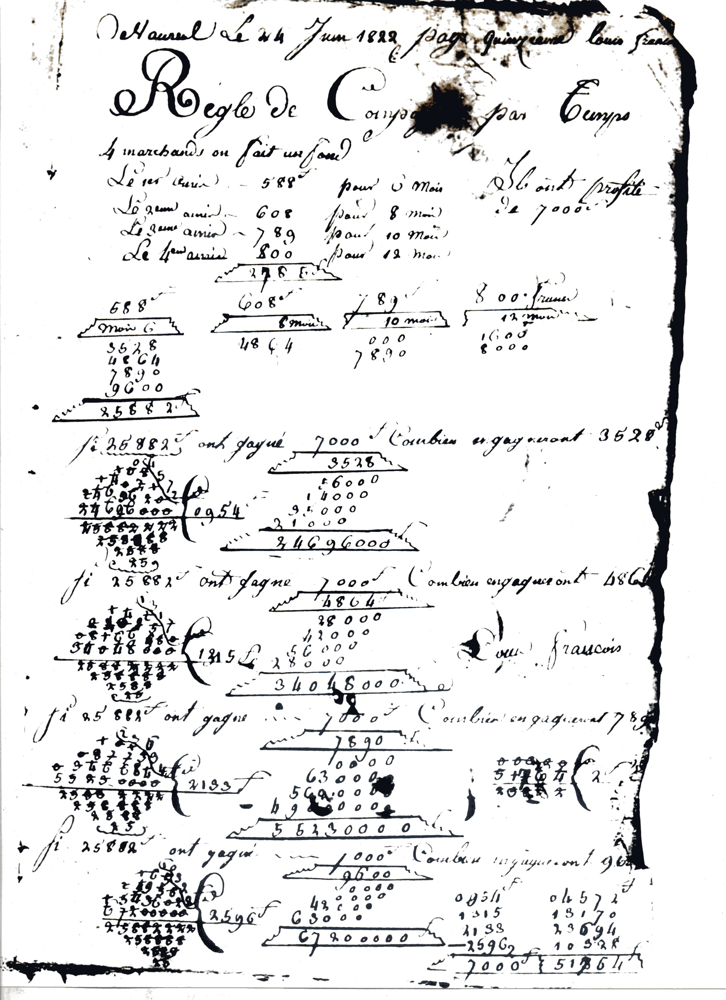
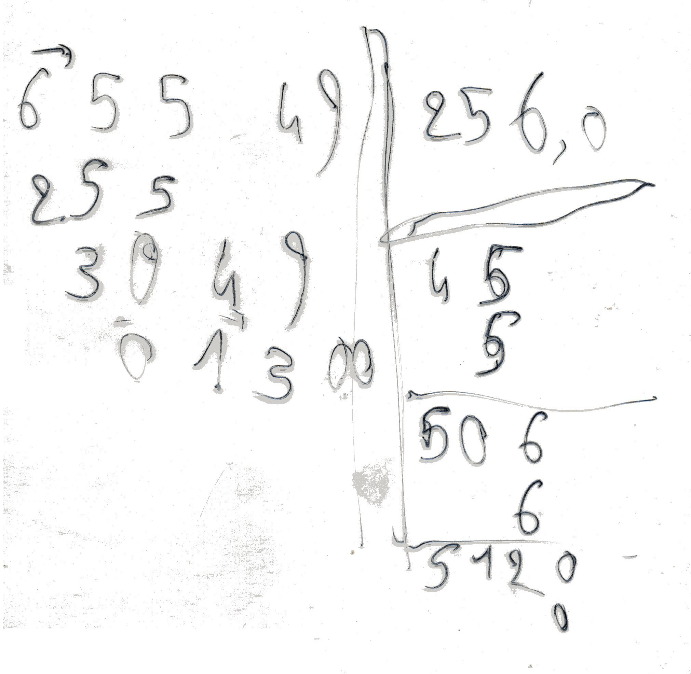
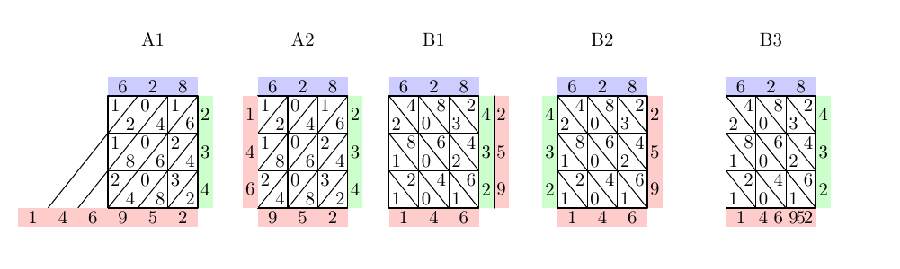
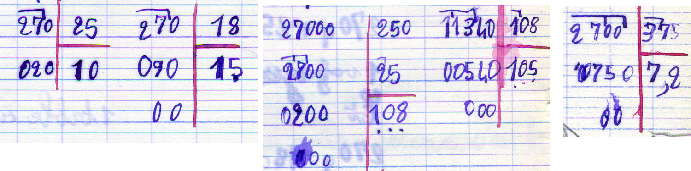
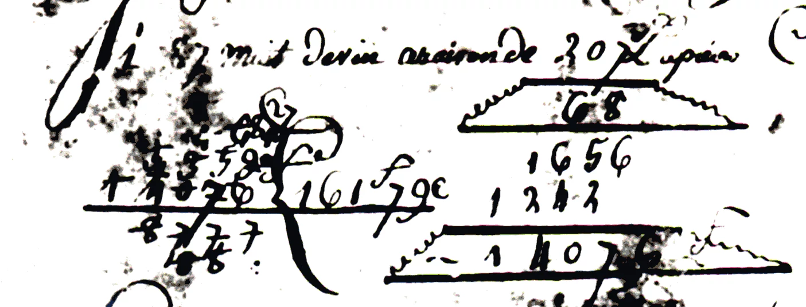
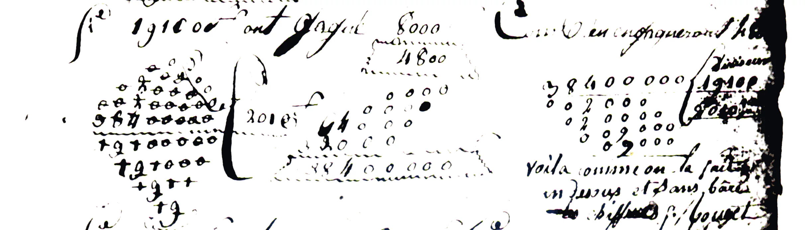
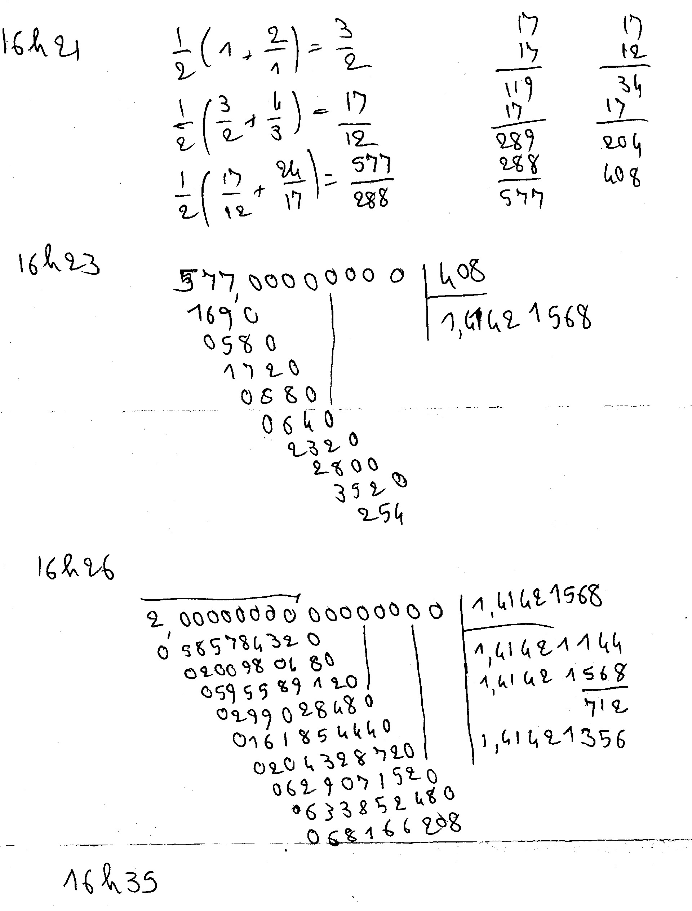
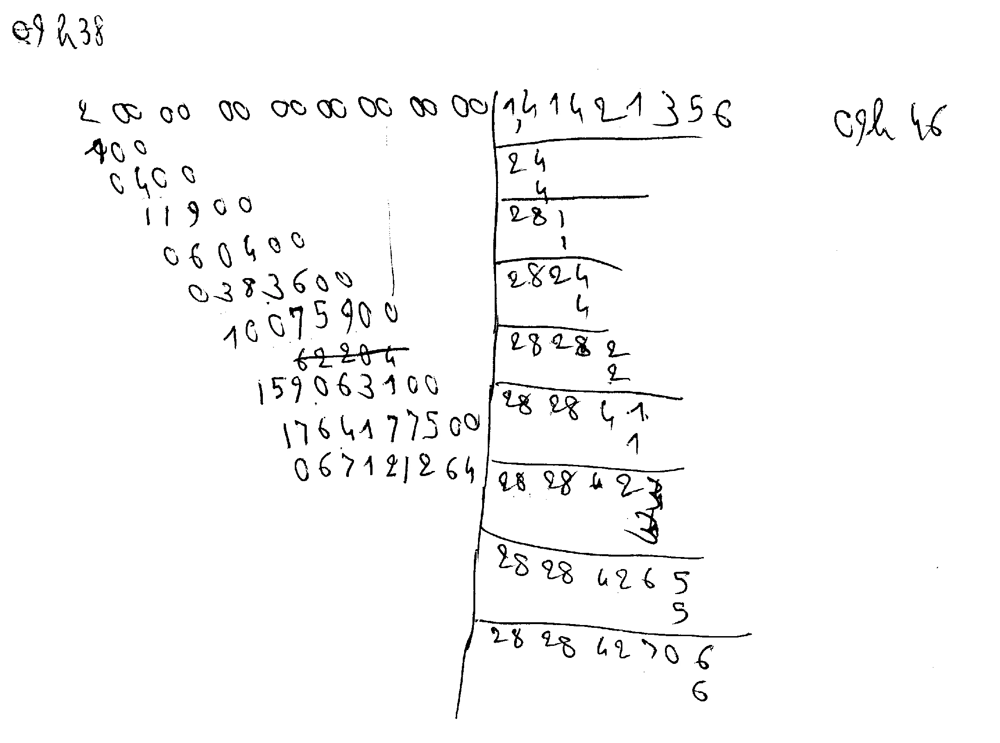

-*- encoding: utf-8; indent-tabs-mode: nil -*-

Introduction
============

Le module  a pour but de  simuler les opérations arithmétiques  par un
humain qui ne dispose pas de calculatrice, mais simplement de quelques
feuilles de papier et d'un crayon.

Historique
==========

Pendant les  années 1960 (en  débordant un  peu sur les  années 1970),
j'ai  appris les  quatre opérations  de base,  addition, soustraction,
multiplication et division.


En 1976,  j'ai appris également  à extraire des racines  carrées, avec
une méthode très proche de la division en « potence » apprise quelques
années plus tôt.

```
200000000|14142
100      |-----
 0400    |24
  11900  | 4
   060400|---
    03936|281
         |  1
         |----
         |2824
         |   4
         |-----
         |28282
         |    2
         |
```

En 1979,  mon père a  reçu des photocopies d'un  cahier d'arithmétique
datant de 1822. Ce cahier  contient des divisions assez différentes de
ce que  mon père  et moi  connaissons. J'ai  fait un  peu d'ingéniérie
inverse sur ce cahier et je  pense avoir retrouvé la méthode utilisée.
Néanmoins, c'est toujours hypothétique.



Voici les  deux premières divisions  de la page  présentée ci-dessus :
24696000 divisé par 25882 donne 954, reste 4572 et 34048000 divisé par
25882 donne 1315, reste 13170.  Ces divisions correspondent aux règles
de trois (7000 ×  3528) / 25882 et (7000 × 4864)  / 25882. Vous pouvez
d'ailleurs  voir  les  multiplications   correspondantes  à  côté  des
divisions. La  transcription ci-dessous ne  montre pas que  les restes
4572 et 13170 sont soulignés par un trait oblique.

<pre>
   0<u>4</u>                   <u>13</u>
  <strike>108</strike><u>5</u>                 <strike>142</strike><u>1</u>
 <strike>14021</strike><u>7</u>               <strike>04015</strike><u>7</u>
<strike>2469620</strike><u>2</u>             <strike>0816648</strike><u>0</u>
<u><strike>24696000</strike></u>{0954        <u><strike>34048000</strike></u>{1315
--------             --------
<strike>25882222</strike>             <strike>25882222</strike>
 <strike>258888</strike>               <strike>258888</strike>
  <strike>2588</strike>                 <strike>2588</strike>
   <strike>25</strike>                   <strike>25</strike>
</pre>

Si vous trouvez  illisibles les chiffres barrés, voici  de nouveau les
deux divisions, sans barrer les chiffres.

```
   04                 13
  1085               1421
 140217             040157
24696202           08166480
24696000{0954      34048000{1315
--------           --------
25882222           25882222
 258888             258888
  2588               2588
   25                 25
```

En 1982, pour un projet d'histoire des sciences, j'ai emprunté _Number
Words  and Number  Symbols, A  Cultural History  of Numbers_,  de Karl
Menninger, je l'ai lu et je l'ai rendu à la bibliothèque.

En 1996,  j'ai acheté et lu  _Histoire d'Algorithmes, du caillou  à la
puce_.

En 2000  ou 2001, j'ai  écrit un programme Perl  permettant d'extraire
des racines  carrées avec  la méthode  de la  potence. Ce  programme a
disparu de la circulation et je ne m'en porte pas plus mal.

En 2005, aux
[Journées Perl à Marseille](https://journeesperl.fr/fpw2005/)
j'ai présenté une communication éclair sur
[comment extraire une racine carrée](https://journeesperl.fr/fpw2005/talk/201).
La démonstration était uniquement avec  un feutre (émulant un crayon),
un transparent et un rétro-projecteur (émulant une feuille de papier).
Il n'y  avait pas de  programme informatique. C'était prévu  pour « un
jour ou l'autre ». Voici le transparent de cet exposé, montrant que la
racine carrée de 65549,00 est 256,0, avec un reste de 13,00.



```
6554900|256,0
255    |-----
 3049  |45
  01300| 5
       |--
       |506
       |  6
       |---
       |5120
       |   0
```

En  2009,  j'ai acheté  un  exemplaire  de  _Number Words  and  Number
Symbols, A  Cultural History  of Numbers_  et j'ai  pu le  consulter à
loisir, sans être contraint de le rapporter à la bibliothèque.

En 2023, je  commence à écrire ce  programme en Raku et  sous la forme
d'un module.

But
===

Le calcul se fait à deux niveaux. Prenons le cas de la multiplication.
Il  y  a  d'abord  le  calcul mental,  où  l'écolier  est  capable  de
multiplier deux nombres à  un chiffre pour obtenir un nombre  à 1 ou 2
chiffres. Il y  a ensuite le calcul sur papier,  où l'écolier enchaîne
les opérations  élémentaires pour  obtenir la  multiplication complète
d'un nombre à _n_ chiffres par un nombre à _n'_ chiffres.

Le module contient principalement deux classes. La première est la classe des
nombres, où les opérations sont très limitées, correspondant au calcul
mental  sans  papier.  Par  exemple,  la  multiplication  est  définie
uniquement pour deux facteurs à un seul chiffre.

La  deuxième classe  représente  une feuille  de  papier (ou  quelques
feuilles).  Le  principal  attribut  de cette  classe  est  une  liste
d'actions, représentant  l'écolier lisant des chiffres  déjà inscrits,
effectuant un calcul élémentaire et  écrivant le résultat de ce calcul
sur la  feuille de papier,  tout en prononçant les  phrases convenues,
telles que :

```
  6 fois 8, 48
  je pose 8 et je retiens 4
```

La  classe comporte  plusieurs méthodes  correspondant aux  opérations
arithmétiques,  addition,  soustraction, multiplication,  division  et
racine  carrée.   Ces  méthodes  alimentent  l'attribut   « liste  des
actions ». Une autre méthode affiche ces actions au format HTML. Selon
les paramètres, l'affichage ne comporte que les chiffres mis en forme,
ou  bien l'affichage  énumère en  plus les  phrases prononcées  par la
personne censée effectuer le calcul.

On peut envisager d'autres méthodes d'affichage pour d'autres formats,
comme  le  texte  pur  ou  le  format  L<sup>A</sup>T<sub>E</sub>X  +
Metapost. Mais ce n'est pas une priorité.

Ce que le module ne fera pas
----------------------------

Il y a  des choses que je savais  faire à 10 ans mais que  je n'ai pas
prévu  de reprendre  dans le  module. Notamment,  je savais  faire des
opérations avec  des nombres à  virgule. Le  module ne traite  que des
nombres entiers. Tenir  compte de la virgule dans  les nombres traités
nécessiterait  l'ajout  de très  nombreuses  lignes  de code  pour  un
intérêt assez limité.  Donc en fait ma démo des  Journées Perl de 2005
ne pourra pas être reprise telle  quelle. Il faudra calculer la racine
carrée de 6554900 avec le module,  puis, après avoir quitté ce module,
insérer la virgule à l'endroit nécessaire. Ou alors, pour calculer une
valeur  approchée de  π à  6 décimales  avec la  fraction 355/113,  il
faudra à la place calculer la division 355_000_000 / 113 et insérer la
virgule juste après le premier chiffre.

Un  autre point.  Dans les  divisions, la  détermination des  chiffres
successifs du  quotient est  un processus  d'essais et  d'erreurs. Par
exemple, pour diviser  65400 par 1852, on commence  par se restreindre
au premier  chiffre du  dividende et au  premier chiffre  du diviseur,
soit  6   et  1,  ce qui donne  pour le quotient  le chiffre   6. En
voulant  calculer le  reste intermédiaire,  on voit  que  6   est trop
fort, donc on recommence avec  5.  5  est lui-même trop fort, donc on
recommence avec   4  puis  3   qui convient finalement.  Cela, c'était
l'apprentissage  basique.  Ultérieurement,  j'ai   appris  que  si  le
deuxième chiffre du  diviseur était  9  ou même  8,  on pouvait assez
souvent évaluer le  chiffre du diviseur en prenant  le premier chiffre
du diviseur, _plus  1_, avec le premier chiffre du du dividende, pour
déterminer le chiffre du quotient. Dans le cas de 65400 et de 1852, le
premier chiffre du quotient aurait été  évalué avec la division de 6
par  2, donc directement  3. Mon module ne fait pas cela. Toutefois,
il est prévu une option « triche » où le module élimine les tentatives
ratées de  6  puis de  5  et de  4. Cela donne dans le module

```
  En 6, combien de fois 1, il y va 6 fois.
  Mais je triche et j'essaie directement 3.
```

En fait,  cela revient  presque au  même, si ce  n'est que  mon module
passe plus de temps à faire des calculs qu'il abandonnera ensuite. Une
autre différence est que pour la division 74500 par 1852, l'évaluation
initiale 7/2 donne 3, alors que  le premier chiffre du quotient est 4.
Le module essaie 7, 6, 5 puis 4 sans essayer 3 qui est trop faible. Il
teste  donc uniquement  si  un chiffre  est trop  fort,  jamais si  un
chiffre est trop faible.

Est-il  indispensable d'ajouter  un  signe plus  (ou  plusieurs) à  la
gauche d'une addition,  un signe moins à la  gauche d'une soustraction
et  un signe  multiplier à  la gauche  d'une multiplication ?  Au tout
début de mes  leçons, c'est ce que j'ai appris,  mais très rapidement,
cela a  été abandonné.  De temps  à autre,  il m'arrivait  d'écrire un
signe  multiplier,   mais  en  règle  générale,   mes  multiplications
n'avaient pas de  signe. Le module n'écrira pas ces  signes. Une seule
exception,  la conversion  d'une base  à une  autre, qui  enchaîne les
multiplications avec les additions.  Pour une meilleure lisibilité, le
module ajoutera  les signes multiplier  et plus  là où ils  doivent se
trouver.

Le module utilise uniquement des  chiffres indo-arabo-latins (0, 1, 2,
3, etc).  Il n'est  pas prévu d'utiliser  des chiffres  indo-arabes (٠
pour 0, ١  pour 1, ٢ pour  2, ٣ pour 3,  ٤ pour 4, etc)  ou chinois ou
autres  systèmes  positionnels.  Et   encore  moins  les  systèmes  de
numération additifs  comme les hiéroglyphes égyptiens  et les chiffres
romains.

Un humain  suffisamment expérimenté (moi-même à  10 ans, mais pas  à 8
ans) est capable d'identifier des cas  de figure où l'on peut recourir
à des  simplifications, par  exemple lorsque  le multiplicateur  ou le
multiplicande  possède de  nombreux  chiffres à  zéro.  Mon module  ne
détectera pas  ces cas de  figure et suivra aveuglément  la procédure,
même si cela tourne au ridicule.

Mon module peut être considéré  comme un équivalent de `bigint`. C'est
vrai  tant que  l'on ne  s'intéresse pas  aux performances.  Un module
`bigint` a pour objectif des calculs performants en précision étendue,
ce n'est pas le cas de mon  module, qui a pour objectif des calculs en
précision étendue et décomposables en calculs simples.

Non seulement les performances ne sont pas au rendez-vous, mais il y a
l'ergonomie. Supposons  que l'on  veuille calculer  `√(b² -  4ac)`. Il
faudrait écrire un programme du genre :

```
my Arithmetic::PaperAndPencil::Number $a;
my Arithmetic::PaperAndPencil::Number $b;
my Arithmetic::PaperAndPencil::Number $c;
# initialisation de a, b et c, à compléter
...
# fin de l'initialisation, début du calcul
my Arithmetic::PaperAndPencil::Number $quatre .= new(value => '4');
my Arithmetic::PaperAndPencil::Number $resultat;

my Arithmetic::PaperAndPencil $feuille .= new;
$resultat = $feuille.squareroot($feuille.subtraction($feuille.multiplication($b, $b), $feuille.multiplication($quatre, $feuille.multiplication($a, $c))))
```

Et encore, dans l'exemple  ci-dessus, les paramètres sont prétendument
des  paramètres positionnels,  alors  que dans  la  réalité, ils  sont
spécifiés par des mots-clés.

Un  dernier point  où,  en fait,  je suis  d'accord  avec mon  module.
Lorsque l'on m'a enseigné les  opérations arithmétiques, j'ai appris à
ne pas  écrire les retenues, mais  à les conserver en  mémoire à court
terme. Mon module fera pareil, il n'écrira pas les retenues.

Ce que le module fera
---------------------

Lorsque j'avais 10  ans, je ne savais pas encore  extraire des racines
carrées, je ne connaissais pas la « variante 1822 » (ou variante « bateau ») de la division, ni
certaines autres variantes de la  multiplication et de la division. Le
module contiendra ces opérations et ces variantes.

La plupart  des êtres humains  savent calculer en base  10 uniquement.
Certains  ont une  connaissance limitée  des  calculs en  octal et  en
hexadécimal,  Mon  module  sera  capable de  faire  des  calculs  dans
n'importe quelle  base de 2  à 36. Ainsi,  la classe de  calcul mental
sait qu'en base  36, `Z × Z = Y1`  (équivalent en base 10 : 35  × 35 =
1225 = 36 × 34 + 1).

Lorsque j'ai appris  les bases de numération, j'ai  appris à convertir
les  nombres de  base 10  en  base _b_  en effectuant  une cascade  de
divisions  et à  convertir  les nombres  de  base _b_  en  base 10  en
effectuant  un calcul  de polynôme  avec le  schéma de  Horner (je  ne
savais pas que cela s'appelait le  schéma de Horner, je ne savais même
pas ce  qu'était un  polynôme, mais  peu importe,  je savais  faire le
calcul).  Mais je  n'ai pas appris à convertir  directement d'une base
_b_ à une  base _b'_. Ultérieurement, j'ai découvert  que certains cas
particuliers, comme  la conversion  de base 2  en base 4,  8 ou  16 ou
inversement,  peuvent donner  lieu à  un  calcul très  simple et  très
rapide. Mais je n'étais toujours pas  en mesure de convertir un nombre
directement de  la base  _b_ à la  base _b'_ dans  le cas  général. Le
module permettra de convertir un nombre  de base _b_ en base _b'_ pour
n'importe quelles bases entre 2 et 36.

Les nombres implémentés par le module  ne sont pas limités. Ou plutôt,
la limitation  est imposée par  l'interpréteur Raku et par  la machine
sur laquelle il est installé. Ainsi, il sera possible de reproduire la
multiplication de
[Frank Nelson Cole](https://fr.wikipedia.org/wiki/Frank_Nelson_Cole),
lorsqu'il a montré les diviseurs du
[67<sup>e</sup> nombre de Mersenne](https://fr.wikipedia.org/wiki/147_573_952_589_676_412_927)
en 1903.  Lorsque j'avais 10  ans, j'avais qualitativement  toutes les
connaissances nécessaires  pour effectuer  la même  multiplication que
Cole, mais  quantitativement cela  m'aurait demandé  trop de  temps et
trop d'efforts.

Lorsque j'ai appris à effectuer  des multiplications et des divisions,
j'ai appris les phrases qui vont avec (« En 6, combien de fois 1, il y
va 6 fois. »). Ces phrases sont, bien entendu, en français. Toutefois,
le module prévoit un mécanisme  de multi-linguisme. Donc, si je reçois
l'aide de  personnes anglophones,  germanophones ou autres,  le module
pourra écrire ces phrases en anglais, en allemand etc.

Une source de confusion éventuelle
----------------------------------

Les nombres utilisés par le module sont de deux natures distinctes. Il
y   a  les   nombres  qui   servent  au   calcul  demandé   (addition,
multiplication, racine carrée) et qui  sont des instances de la classe
`Arithmetic::PaperAndPencil::Number`. On trouve également dans cette
nature les morceaux de nombres : chiffres des unités, retenues, etc.
Et  il y a les  nombres annexes, qui servent à compter le nombre d'éléments dans un tableau ou
qui  servent à  exprimer les  bases de  numération et  les coordonnées
ligne-colonne pour  la mise  en forme  de l'opération.  Ces nombres-là
sont simplement des  `Int` natifs de Raku, ils ne  sont pas soumis aux
limites  du calcul  mental, comme  l'impossibilité de  multiplier deux
nombres si l'un des deux a plusieurs chiffres.

Opérations
==========

Addition
--------

Pas de variante, pas de cas particulier. Il n'y a rien à dire.

Soustraction
------------

La soustraction étant une addition « à l'envers », il semblerait qu'il
n'y ait pas plus  à dire à son sujet qu'au  sujet de l'addition. C'est
faux.  Il   faut  d'abord  distinguer  la   soustraction  indépendante
(c'est-à-dire en dehors de toute  division) et la soustraction incluse
(calcul du reste intermédiaire dans une division). De plus, si je n'ai
pas  prévu  de  variante pour  l'addition,  il  y  en  a une  pour  la
soustraction,  la  variante avec  le  complément  à _b_,  ainsi  qu'on
l'apprend  en cours  de programmation  assembleur (complément  à 2  ou
complément à 16).

### Soustraction indépendante

Une soustraction  se fait en  une seule phase. Toutefois,  lorsque les
deux nombres  à soustraire  sont très  différents, on  peut distinguer
jusqu'à trois sous-phases. Prenons par exemple la soustraction

```
123450000012345
-       8867700
---------------
```

La première sous-phase correspond aux opérations sur les chiffres du nombre
bas. Cela correspond à l'image que l'on se fait de la soustraction.

```
123450000012345
-       8867700
---------------
        1144645
```

Il n'y a plus de chiffre dans le nombre bas, mais il reste une retenue
à traiter. On passe à la deuxième sous-phase.

```
123450000012345
-       8867700
---------------
    49991144645
```

Maintenant,  il n'y  a ni  retenue, ni  chiffre du  nombre du  bas. La
troisième sous-phase consiste donc  simplement à recopier les chiffres
restants du nombre du haut.

```
123450000012345
-       8867700
---------------
123449991144645
```

Dans certains cas,  la deuxième sous-phase et  la troisième sous-phase
peuvent être absentes. Notamment, pour les soustractions permettant de
calculer le reste intermédiaire dans une division ou une extraction de
racine carrée, la seconde sous-phase  concernera au maximum un chiffre
du nombre du haut et la troisième sous-phase sera réduite à néant.

### Soustraction incluse dans un autre calcul

Prenons l'exemple de la division

```
---
9212|139
    |---
    |6
```

Lorsque  l'élève  calcule  le  reste intermédiaire,  il  commence  par
calculer  « 6 fois  9, 54 ».  Puis il  compare ce  produit 54  avec le
chiffre 1. L'élève  prononce alors « et 7, 61 » (ou  bien « ôté de 61,
reste 7 ») et « je pose 7, je retiens 6 »

Que  se  passe-t-il   en  réalité ?  Les  données  en   entrée  de  la
soustraction sont :

* un nombre « haut » à un seul chiffre (1 dans l'exemple), que vous
pouvez interpréter comme un nombre partiellement connu « ?1 »,

* un nombre « bas » à un ou deux chiffres (54 dans l'exemple).

Les données en sortie sont :

* un nombre  « haut » habituellement ajusté  à deux chiffres  (61 dans
l'exemple),

* le résultat de la soustraction, un seul chiffre (7 dans l'exemple).

Ce processus est un processus mental,  sans trace écrite, donc il fait
partie  de  la  classe  `Arithmetic::PaperAndPencil::Number`.  Il  est
utilisé également dans  la soustraction indépendante, même  si dans ce
cas on sait d'avance que la retenue ne peut pas dépasser `1`.

Une remarque annexe. Lorsque j'ai appris l'arithmétique dans mon jeune
âge, j'ai  appris à dire  « 6 fois  9, 54, et  7, 61 » alors  que dans
d'autres écoles, c'était plutôt « 6 fois  9, 54, ôté de 61, reste 7 ».
À  vrai dire,  je n'ai  pas compris  et je  ne comprends  toujours pas
pourquoi la  version que  j'ai apprise est  censée être  meilleure que
l'autre version. Peu importe, au final le message implémenté est celui
que j'ai appris. Pour les  autres langues, anglais, italien, espagnol,
etc.,  je   fais  confiance  à   quiconque  me  donnera   les  phrases
conventionnelles dans sa langue maternelle.

### Soustraction utilisant le complément à _b_

Cette variante est utilisé pour  la partie fractionnaire (ou mantisse)
des  logarithmes et  pour la  soustraction en  base 2  et en  base 16.
Pourtant, elle fonctionne avec les  entiers dans n'importe quelle base
de numération. Je  donnerai l'exemple en décimal avec  le complément à
10. Je reprends la soustraction de l'exemple ci-dessus.

```
123450000012345
-       8867700
---------------
```

Pour calculer  la différence, on  prend le complément à  10 (puisqu'on
est  en décimal)  du nombre  du bas.  En fait,  il n'y  a pas  un seul
complément  à 10,  il y  en a  plusieurs, en  fonction de  la longueur
souhaitée. Lors de calculs de logarithmes avec 5 décimales, ou lorsque
l'on écrit des  programmes assembleurs pour une machine à  16 bits, le
contexte  nous impose  une  longueur pour  le complément  à  10 ou  le
complément à 2, donc  la question est éludée. Ici le  nombre du haut a
15 chiffres, donc  on prend le complément à 10  de 8866700 de longueur
15. Il y a deux façons de le calculer.

Première façon : on  complète le nombre par des zéros  pour obtenir la
longueur souhaitée (15 dans l'exemple).

```
        8867700
000000008867700
```

On examine les chiffres en partant de la droite. Tant qu'il y a des
zéros, on les laisse tels quels.

```
000000008867700
             00
```

Le chiffre  suivant, et  uniquement ce chiffre,  est remplacé  par son
complément à 10. Dans l'exemple, 7 devient 3.

```
000000008867700
            300
```

Enfin on remplace  tous les chiffres restants par leur  complément à 9
(y compris les zéros restants). Dans l'exemple, 7 devient 2, 6 devient
3, 8 devient 1 et 0 devient 9.

```
000000008867700
999999991132300
```

Deuxième façon de calculer le complément  à 10 : on complète le nombre
par des zéros pour obtenir la longueur souhaitée.

```
        8867700
000000008867700
```

On remplace tous les chiffres, sans exception, par leur complément à 9.

```
000000008867700
999999991132299
```

Et on ajoute 1.

```
000000008867700
999999991132299
              1
---------------
999999991132300
```

Une fois que l'on a obtenu le complément  à 10 du nombre du bas par la
première ou la deuxième méthode, on l'additionne au nombre du haut.

```
 123450000012345
 999999991132300
----------------
1123449991144645
```

Il  y  a forcément  un  chiffre  supplémentaire  (qui fait  passer  le
résultat à  16 chiffres dans  l'exemple) et ce  chiffre supplémentaire
est forcément  1. On supprime  ce chiffre  et on obtient  le résultat,
123449991144645.

Bien sûr, en base 2 on parlera du complément à 1 et du complément à 2.
En base 16, on peut parler du  complément à 15 (ou F) et du complément
à 16,  mais comme la  base 16 est, en  quelque sorte, une  « vision de
haut-niveau » de  la base 2,  il arrive  fréquemment que, par  abus de
langage, on parle de complément à 1 et de complément à 2 en base 16.

Multiplication
--------------

### Standard

La multiplication standard est la multiplication bien connue

```
   628
   234
  ----
  2512
 1884.
1256..
------
146952
```

Y a-t-il quelque chose à ajouter ? Oui. Il y a deux sous-variantes. La
première  est la  sous-variante « avec  raccourcis ». Si,  au lieu  de
multiplier 628 par 234, on le  multiplie par 333, la variante standard
basique effectue trois fois le même calcul, ce qui donne :

```
3 fois 8, 24, je pose 4 et je retiens 2
3 fois 2, 6, et 2, 8, je pose 8 et je ne retiens rien
3 fois 6, 18, je pose 18

   628
   333
  ----
  1884

3 fois 8, 24, je pose 4 et je retiens 2
3 fois 2, 6, et 2, 8, je pose 8 et je ne retiens rien
3 fois 6, 18, je pose 18

   628
   333
  ----
  1884
 1884.

3 fois 8, 24, je pose 4 et je retiens 2
3 fois 2, 6, et 2, 8, je pose 8 et je ne retiens rien
3 fois 6, 18, je pose 18

   628
   333
  ----
  1884
 1884.
1884..
```

Dans la variante avec raccourcis, ces calculs sont effectués une seule
fois. Les deux autres fois, le calculateur se contente de recopier une
ligne existante, ce qui donne :

```
3 fois 8, 24, je pose 4 et je retiens 2
3 fois 2, 6, et 2, 8, je pose 8 et je ne retiens rien
3 fois 6, 18, je pose 18

   628
   333
  ----
  1884

Je recopie la ligne 1884

   628
   333
  ----
  1884
 1884.

Je recopie la ligne 1884

   628
   333
  ----
  1884
 1884.
1884..
```

L'autre sous-variante ne correspond pas à une pratique connue (tout au
moins  connue  par   moi),  elle  est  simplement   l'extension  à  la
multiplication du principe  de la division préparée.  Sur une première
feuille de papier, le calculateur établit la table de mutiplication de
628. Dans le  cas de la division,  il faut aller jusqu'à  « 9 × 628 »,
ici  on sait  que l'on  peut  s'arrêter à  « 4  × 628 ».  Puis sur  la
deuxième page, la  multiplication proprement dite ne  comporte que des
copies de lignes :

```
1 fois 628,  628
2 fois 628, 1256
3 fois 628, 1884
4 fois 628, 2512
Page suivante

   628
   234
  ----

Je recopie la ligne 2512

   628
   234
  ----
  2512

Je recopie la ligne 1884

   628
   234
  ----
  2512
 1884.

Je recopie la ligne 1256

   628
   234
  ----
  2512
 1884.
1256..
```

En fait, la  variante « préparée » est moins efficace  que la variante
« avec raccourcis ».  Supposons que  le multiplicateur soit  `747`. La
variante avec raccourcis calculera uniquement `4  × 628` et `7 × 628`,
tandis  que  la  variante  « préparée » calculera  tous  les  produits
partiels de `2 × 628` jusqu'à `7 × 628`.

Il manque  la dernière étape, l'addition  des produits intermédiaires.
Cette étape est identique pour  les trois variantes, c'est pourquoi je
ne m'appesantis pas dessus.

### Variante « par jalousie »

Pour ce paragraphe, j'ai repris  l'exemple de la multiplication de 628
par 234,  qui donne 146 952.  Le multiplicande  est sur fond  bleu, le
multiplicateur sur fond vert et le produit sur fond rose. Ces couleurs
sont là uniquement pour faciliter la compréhension des exemples. Elles
ne figurent pas dans les véritables multiplications.

Longtemps avant  de lire  _Histoire d'algorithmes_ (_HAL_)  et _Number
Words and  Number Symbols_  (_NWNS_), j'avais  eu vent  d'une variante
rectangulaire  de  la  multiplication.  Elle  avait  la  forme  de  la
multiplication A1 ci-dessous.



Dans _NWNS_ à la page 442, l'auteur donne un exemple de multiplication
en chiffres indo-arabo-latins (0, 1, 2,  3, etc) conforme au modèle A2
et le même exemple en chiffres indo-arabes (٠ pour 0, ١ pour 1,  ٢ pour 2, ٣ pour  3, etc)
et conforme au  modèle B3, avec la volonté de  mettre tout le résultat
sur la dernière  ligne en tassant les chiffres. Le  nom de la variante
vient  de  l'italien,  _multiplicare  per gelosia_,  ce  qui  signifie
« multiplier à  la manière d'une  jalousie » (dans le sens  de « store
vénitien »).

Dans  _HAL_,  cela  commence  page 26  avec  une  multiplication  dans
laquelle le  multiplicateur a un  seul chiffre et utilisant  le modèle
A1. Cet exemple est tiré du
[_Līlāvatī_](https://sanskritlibrary.org/catalogsText/titus/class/bhasklil.html)
de Ganesa.  _HAL_ donne  plusieurs noms  pour cette  technique : « par
tableau », « par grillage », « par  filets » et « par jalousie ». J'ai
conservé ce  dernier, qui est identique  en anglais et qui  reprend le
terme italien donné par _NWNS_.

Ensuite, dans _HAL_, la page 28 présente une multiplication extraite de
[_Miftāh   al-hisāb_](https://gallica.bnf.fr/ark:/12148/btv1b10030739h.image)
du mathématicien  Al-Kāshī'. Dans  cette multiplication, les  côtés du
rectangle sont  inclinés de 45°  par rapport  à l'horizontale ou  à la
verticale. De plus, les nombres sont en base 60 (degrés, minutes, etc)
en caractères arabes et écrits de droite à gauche. Page 29, il y a une
multiplication B2 écrite de droite à gauche, le multiplicateur ayant un
seul chiffre comme à la page 26. Page 30, vous
trouvez une multiplication selon le  modèle A2 et en chiffres chinois,
venant de _Jiunzhang suanfa bilei  daquan_, un manuscrit de 1450. Page
32, il  y a une multiplication  A2 et une multiplication  B1 provenant
d'un traité anonyme publié en 1478  à Trévise et une multiplication B2
et une multiplication A2 provenant  d'un traité d'arithmétique de 1494
écrit par Luca Pacioli.

La  multiplication  A1 est  un  peu  encombrante,  mais on  peut  s'en
accommoder. La multiplication B1 peut
prêter à confusion, le multiplicateur étant collé à la dernière partie
du produit. Quant à la  multiplication B3, elle est presque illisible,
elle n'est pas  pédagogique (quelqu'un qui découvre  cette variante ne
peut pas deviner comment sont calculés les trois
derniers  chiffres)  et elle  est  incompatible  avec des  coordonnées
ligne-colonne de type `Int`. Par  conséquent, le module ne prévoit que
la  multiplication A2  et la  multiplication B2,  renommées simplement
« jalousie-A »  et « jalousie-B »,  ainsi  que  la multiplication  A1,
nommée  elle aussi  « jalousie-A »,  mais avec  en  plus un  paramètre
`:product<straight>`.  Ce paramètre  peut s'appliquer  également à  la
multiplication  « jalousie-B ». Je  signale  en outre  que les  lignes
internes horizontales  et verticales ne  sont pas tracées.  Cela donne
ceci :

```
   6 2 8               6 2 8             6 2 8          6 2 8
  --------            --------         --------       --------
 1|1/0/1/|            |1/0/1/|         |\4\8\2|       |\4\8\2|
  |/2/4/6|2           |/2/4/6|2       4|2\0\3\|2     4|2\0\3\|
 4|1/0/2/|           /|1/0/2/|         |\8\6\4|       |\8\6\4|
  |/8/6/4|3         / |/8/6/4|3       3|1\0\2\|5     3|1\0\2\|\
 6|2/0/3/|         / /|2/0/3/|         |\2\4\6|       |\2\4\6| \
  |/4/8/2|4       / / |/4/8/2|4       2|1\0\1\|9     2|1\0\1\|\ \
  --------       / /  --------         --------       -------- \ \
   9 5 2        1 4 6  9 5 2             1 4 6          1 4 6  9 5 2
```

Avec une petite  différence dans la mesure où je  ne sais pas utiliser
le  soulignement en  Markdown. Je  l'ai  remplacé ici  par de  simples
tirets. Dans le HTML généré, le  multiplicande et la dernière ligne du
rectangle utilisent la balise HTML de soulignement `<u>`. En revanche,
les traits verticaux et diagonaux  sont représentés par des caractères
« pipe », « slash » et « backslash ».

### Variante « bateau » (_boat_)

Cette variante est décrite dans _NWNS_ à la page 440. Elle ressemble à
la  variante  « boat » de  la  division,  c'est  pourquoi je  lui  ai
attribué le même nom.

Karl Menninger commence  par décrire le principe  indépendamment de la
disposition  réelle des  chiffres. Reprenons  la multiplication  234 ×
628. Le  premier produit intermédiaire  est le  produit 234 ×  6. Cela
donne :

```
  24
 18
12
------
   628
------
 234
```

Le  deuxième produit  intermédiaire  est  234 ×  2,  en réécrivant  le
multiplicateur  234   aligné  cette   fois  avec   le  chiffre   2  du
multiplicande. La multiplication devient alors :

```
   08
  06
 04
------
  24
 18
12
------
   628
------
 234
  234
```

Et le troisième produit intermédiaire est 234 × 8, après avoir écrit
le multiplicateur aligné avec le chiffre 8 du multiplicande :

```
    32
   24
  16
------
   08
  06
 04
------
  24
 18
12
------
   628
------
 234
  234
   234
```

Finalement, l'addition des produits intermédiaires

```
146952
------
    32
   24
  16
------
   08
  06
 04
------
  24
 18
12
------
   628
------
 234
  234
   234
```

Cela,  c'était le  principe. En  fait,  la multiplication  se fait  en
écrivant chaque chiffre dans la première case disponible dans la bonne
colonne. Et je supprime les zéros de tête. Je reprends les différentes
étapes, en mettant en regard le principe (après avoir enlevé les zéros
de tête) et le réel.

<pre>
  24
 18         12
12         1284
------     ------
   628        628
------     ------
 234        <strike>234</strike>
</pre>

Deuxième étape.

<pre>
    8
   6
  4
------
  24         4
 18         126
12         12848
------     ------
   628        <strike>6</strike>28
------     ------
 234        <strike>2344</strike>
  234        <strike>23</strike>
</pre>

Troisième étape.

<pre>
    32
   24
  16
------
    8
   6
  4
------       12
  24         463
 18         1264
12         128482
------     ------
   628        <strike>62</strike>8
------     ------
 234        <strike>23444</strike>
  234        <strike>233</strike>
   234        <strike>2</strike>
</pre>

Et l'addition des produits intermédiaires.

<pre>
  146952
  ------
      32
     24
    16
  ------
      8
     6
    4          69
  ------       <strike>12</strike>5
    24        4<strike>463</strike>
   18        1<strike>1264</strike>2
  12         <strike>128482</strike>
  ------     ------
     628        <strike>628</strike>
  ------     ------
   234        <strike>23444</strike>
    234        <strike>233</strike>
     234        <strike>2</strike>
</pre>

En fait, dans  la description de _NWNS_, les  produits élémentaires se
font de  droite à  gauche, alors que  je les ai  exécutés de  gauche à
droite ci-dessus. Voir la différence  ci-dessous, avec sur la première
ligne les  étapes successives de  droite à  gauche et sur  la deuxième
ligne les étapes successives de gauche à droite

<pre>
               8         28
    24        124       1124
  ------     ------     ------
     628        628        <strike>6</strike>28
  ------     ------     ------
   23<strike>4</strike>        2<strike>34</strike>        <strike>234</strike>

              1          12
  12         128        1284
  ------     ------     ------
     628        628        <strike>6</strike>28
  ------     ------     ------
   <strike>2</strike>34        <strike>23</strike>4        <strike>234</strike>
</pre>

Page 441,  _NWNS_ présente la  version médiévale de  l'opération, dans
laquelle  chaque produit  élémentaire  est  additionné aux  précédents
immédiatement après avoir été calculé, et non pas à la fin. Là encore,
le calcul  se fait  de droite à  gauche. Les  résultats intermédiaires
sont `4 × 6 = 24`, `30 × 6 + 24 = 204` et `200 × 6 + 204 = 1404`, puis
`4 × 2 + 14040 = 14048`, `30 × 2  + 14048 = 14108` et `200 × 2 + 14108
= 14508` et je vous laisse compléter pour le chiffre 8.

<pre>
                                                           5
                                                1          <strike>1</strike>
               0         40         40         4<strike>0</strike>0        4<strike>0</strike>0
    24        2<strike>2</strike>4       1<strike>22</strike>4       1<strike>22</strike>48      1<strike>224</strike>8      1<strike>224</strike>8
  ------     ------     ------     ------     ------     ------
     628        628        <strike>6</strike>28        <strike>6</strike>28        <strike>6</strike>28        <strike>62</strike>8
  ------     ------     ------     ------     ------     ------
   23<strike>4</strike>        2<strike>34</strike>        <strike>234</strike>        <strike>2344</strike>       <strike>2344</strike>       <strike>2344</strike>
                                     23         2<strike>3</strike>         <strike>23</strike>
</pre>

Là encore on pourrait  envisager d'effectuer les produits élémentaires
de gauche à droite. C'est d'ailleurs ce qui se faisait sur les abaques
et bouliers. On a donc `2  × 6 = 12`, `3 × 6 + 120 =  138` et `4 × 6 +
1380 = 1404`, puis `2  × 2 × 10 + 1404 = 1444`, `3 ×  2 + 1444 = 1450`
et `4 × 2 + 14500 = 14508`.

<pre>
                                               5         5
                         4          44        4<strike>4</strike>        4<strike>4</strike>
              3          <strike>3</strike>0         <strike>30</strike>        <strike>30</strike>0       <strike>30</strike>0
  12         1<strike>2</strike>8        1<strike>28</strike>4       1<strike>28</strike>4      1<strike>284</strike>      1<strike>284</strike>8
  ------     ------     ------     ------    ------    ------
     628        628        <strike>6</strike>28        <strike>6</strike>28       <strike>6</strike>28       <strike>62</strike>8
  ------     ------     ------     ------    ------    ------
   <strike>2</strike>34        <strike>23</strike>4        <strike>234</strike>        <strike>234</strike>4      <strike>234</strike>4      <strike>2344</strike>
                                     <strike>2</strike>3        <strike>23</strike>        <strike>23</strike>
</pre>

### Multiplication égyptienne ou russe

Des  camarades   de  classe   m'ont  appris  il   y  a   longtemps  la
multiplication égyptienne.  Plus tard,  d'autres sources  m'ont montré
que ce  n'était pas exactement  la multiplication égyptienne,  mais la
multiplication  russe,  également  nommée « multiplication  du  paysan
russe ».  La multiplication  égyptienne repose  sur le  même principe,
mais  avec  une disposition  différente.  Supposons  que l'on  veuille
multiplier 628  par 234. On place  les deux nombres côte  à côte (avec
suffisamment d'espace). Puis on divise par deux le nombre de gauche et
on multiplie par  deux le nombre de droite, jusqu'à obtenir le nombre 1.

```
234     628
117    1256
 58    2512
 29    5024
 14   10048
  7   20096
  3   40192
  1   80384
```

Ensuite, sur  chaque ligne, lorsque le  nombre de gauche est  pair, on
raie le nombre de droite.

<pre>
234     <strike>628</strike>
117    1256
 58    <strike>2512</strike>
 29    5024
 14   <strike>10048</strike>
  7   20096
  3   40192
  1   80384
</pre>

Et on fait la somme des nombres restants

<pre>
234     <strike>628</strike>
117    1256
 58    <strike>2512</strike>
 29    5024
 14   <strike>10048</strike>
  7   20096
  3   40192
  1   80384
     ------
     146952
</pre>

On peut considérer  que les divisions par deux  et les multiplications
par deux  soient suffisamment simples  pour ne  pas avoir à  les poser
ainsi :

```
234|2        628     117|2      1256
03 |---        2      17|--        2   etc
 14|117     ----       1|58     ----
  0|        1256                2512
```

Mais même avec cette simplification,  c'est long. Cela revient à faire
une multiplication en  binaire, même si vous travaillez  en décimal ou
en  hexadécimal. J'ai  presque  laissé tomber,  mais finalement,  j'ai
décidé de l'inclure dans le module.

Une autre difficulté.  La méthode repose sur le fait  que l'on dispose
d'un critère simple  pour déterminer si un nombre est  pair ou impair.
En base 10, c'est facile, il suffit  de jeter un coup d'œil au chiffre
des unités. Si le chiffre est pair,  le nombre est pair. Si le chiffre
est  impair,  le  nombre  est  impair. Ce  critère  est  valable  pour
n'importe quelle base de numération paire,  mais pas pour les bases de
numération impaires. Il faut trouver autre chose.

En base 10, le critère de divisibilité par 3 ou par 9 consiste à faire
la somme des  chiffres. Si le nombre obtenu se  constitue de plusieurs
chiffres, on  itère le processus.  Lorsqu'il ne reste plus  qu'un seul
chiffre, on peut conclure.  Si c'est 3, 6 ou 9,  le nombre initial est
divisible par  3. Si c'est 9,  le nombre initial est  divisible par 9.
C'est le même principe  en base 9 pour la divisibilité par  2, 4 et 8.
C'est le même principe  en base 11 pour la divisibilité par  2, 5 et A
et c'est le même principe en base 13 pour la divisibilité par 2, 3, 4,
6 et C.

Prenons  par exemple,  le nombre  45269 en  base 11.  La somme  de ses
chiffres est 26  en base 10 ou  24 en base 11.  Une deuxième itération
donne la  somme 2+4 = 6,  qui est un  chiffre pair. 45269 est  donc un
nombre pair. Heureusement, d'ailleurs, car  il s'agit de 65536 en base
10. Mais 45269 n'est pas divisible par 5 ni par A (10 en base 10).

De même, pour 45268, la somme des  chiffres est 25 en base 10, soit 23
en base 11 pour la première itération, et 5 pour la seconde itération.
Donc 45268 (soit  65535 en base 1) est un  nombre impair divisible par
5.

Si la  base de numération  _b_ est  impaire, 2 est  automatiquement un
diviseur de _b_-1. Donc la méthode de la somme des chiffres fonctionne
pour toutes les bases de numération impaires.

Dans le cas de la divisibilité  par 2, le critère peut être simplifié.
Dans le nombre,  on compte les chiffres impairs et  on ne s'occupe pas
des chiffres pairs.  Il n'y a même plus besoin  de les additionner, il
suffit de les compter.  Si le compte est pair, le  nombre est pair. Si
le compte  est impair,  le nombre est  impair. En  reprenant l'exemple
ci-dessus, le nombre 45269 en  base 11 contient deux chiffres impairs,
5  et 9.  Il est  donc pair.  Quand  au nombre  45268 en  base 11,  il
contient un seul chiffre impair, il est donc impair.

Division
--------

### Division standard

Lorsque  j'ai  appris  la  division standard,  le  calcul  des  restes
intermédiaires   se  faisait   avec   une   opération  combinant   une
multiplication et une soustraction : multiplication du diviseur par le
chiffre  du  quotient et  soustraction  de  ce résultat  au  dividende
partiel. Longtemps  après, j'ai entendu dire  que cette multiplication
et  cette  soustraction étaient  séparées.  Je  me suis  renseigné  en
consultant  des  tutoriels pour  savoir  quelle  était précisément  la
méthode  utilisée :  prépare-t-on  la  division en  calculant  les  10
premiers   multiples   du   diviseur,  ou   bien   effectue-t-on   les
multiplications au fil de l'eau selon les besoins ?

Dans ces [deux](https://www.youtube.com/watch?v=BC_QZjyEdpw)
[tutoriels](https://www.youtube.com/watch?v=eIo9tZ6T5CY),
les auteurs  supposent que l'élève  connaît par cœur les  multiples du
diviseur (la table des 52 dans un  cas et la table des 35 dans l'autre
cas).  Cela me  semble irréaliste.  Un point  annexe, pour  le premier
tutoriel : les nombreuses pauses entre les phrases et le fait que l'on
ne tienne  pas compte du cas  particulier du zéro m'incitent  à penser
que cette vidéo  a été générée par un logiciel  analogue au mien (avec
un format de sortie MPEG ou MP4 au lieu de HTML). Ce n'est pas en soit
un défaut.

Dans ce [tutoriel](https://www.youtube.com/watch?v=IQFKMnvwFPM),
il est clairement  dit que l'on commence par calculer  la table des 23
ou des 16  (ou plus généralement la table des  multiples du diviseur).
Également,  ce tutoriel  précise qu'il  n'y  a pas  une seule  méthode
orthodoxe de division, il y en  a plusieurs, c'est à chacun de choisir
une méthode et de s'exercer à son utilisation.

Ce [tutoriel](https://www.youtube.com/watch?v=bn-IZD-jgl8),
est lui aussi  intéressant. On y retrouve  le « harponnage » (présenté
plus en  détail ci-dessous).  Ce harponnage est  fait avec  des traits
courbes et il  est appelé « chapeau » ou « parapluie »  alors que j'ai
appris  à tracer  ce harponnage  avec des  traits droits  et je  ne me
souviens  pas du  nom  que j'ai  appris à  l'origine.  Un autre  point
intéressant  dans  ce  tutoriel   est  le  mécanisme  essai-et-erreur,
consistant à  calculer un premier  chiffre possible avec  une division
1-par-1 ou 2-par-1 et à le  décrémenter en boucle tant que l'on trouve
une erreur. Un dernier point  intéressant est la vérification à chaque
étape. Chaque  fois que l'on obtient  un chiffre pour le  quotient, on
compare le reste intermédiaire au  diviseur. Si le reste est inférieur
au  diviseur,  il n'y  a  _a  priori_ pas  de  problème.  Si le  reste
intermédiaire  est  supérieur  ou  égal  au diviseur,  alors  il  y  a
assurément  un  problème   de  calcul.  J'ai  appris   à  faire  cette
vérification, mais j'ai choisi de ne pas l'implémenter dans le module.

Et finalement un [tutoriel](https://www.youtube.com/watch?v=pbwoawMMEhU)
qui enseigne  la division  telle que  je l'ai  apprise ou  presque, en
combinant  la  multiplication et  la  soustraction.  Il  y a  même  le
harponnage, avec, comme  ci-dessus, des traits courbes  alors que j'ai
appris  à  le  faire  avec  des traits  droits.  Une autre  différence
marquante est  que les retenues  sont écrites puis barrées,  alors que
j'ai appris à les conserver dans ma mémoire.

La conclusion de tout cela est que je ne dois pas décider par moi-même
quelle est la  solution othodoxe, mais je dois  fournir des paramètres
permettant  à  l'utilisateur de  choisir  quelle  variante il  préfère
générer.

### « Harponnage » dans la division standard

Un point qui mérite peut-être  d'être signalé, c'est le « harponnage »
de la  première ligne. Notons  en préalable  qu'il ne s'agit  pas d'un
terme officiel. C'est un terme que j'ai pioché lorsque j'ai commencé à
écrire  le module  et  sa  documentation. Dans  un  tutoriel que  j'ai
consulté ultérieurement, c'était  appelé « chapeau » ou « parapluie ».
Je ne  me souviens plus s'il  y avait un nom  particulier lorsque j'ai
appris les divisions dans les années 1960-1970.

On ne  voit pas  le harponnage  dans l'exemple du  2 décembre  1970 au
début de cette  documentation, mais on peut le voir  dans les exemples
ci-dessous.



Tout  d'abord, une  précision sur  la  division du  centre, « 27000  ÷
250 ». Il  y a  une simplification  par 10,  pour obtenir  la division
« 2700  ÷  25 », plus  rapide  à  calculer.  C'est  pour cela  que  le
harponnage se produit sur la deuxième ligne dans ce cas.

Le harponnage  simple sert  à repérer l'endroit  du dividende  où l'on
soustraira le  premier chiffre du premier  reste intermédiaire. Ainsi,
lorsque  l'on divise  270 par  25  ou par  18, le  premier chiffre  du
premier reste sera sous le « 7 ».

Le  harponnage  double  a la  même  utilité  et  en  plus, il  sert  à
déterminer la portion du dividende qui servira à effectuer la division
mentale avec le diviseur réduit à un seul chiffre. Ainsi, pour diviser
2700 par  25, la  première évaluation  se fera  avec « 2  ÷ 2 »  et la
soustraction du  reste se fera sous  le « 7 ». Pour diviser  11340 par
108, la première évaluation se fera  avec « 1 ÷ 1 » et la soustraction
du premier reste se fera sous le  « 3 ». Et pour diviser 2700 par 375,
la  première évaluation  se fera  avec un  dividende à  deux chiffres,
c'est-à-dire « 27  ÷ 3 » et la  soustraction du premier reste  se fera
sous le deuxième « 0 ».

On peut  voir que  le double harponnage  du dividende  s'accompagne du
harponnage du  diviseur, invariablement sur un  chiffre. Le harponnage
du diviseur n'a aucun intérêt et je ne l'ai pas repris dans la méthode
`division`.

Le harponnage est visible également dans ces
[deux](https://www.youtube.com/watch?v=bn-IZD-jgl8)
[tutoriels](https://www.youtube.com/watch?v=pbwoawMMEhU),
où  il est  utilisé  pour  tous les  dividendes  partiels  et non  pas
seulement pour le premier. À  mon avis, le harponnage n'est réellement
utile que  sur la première ligne  où le premier dividende  partiel est
noyé dans le dividende complet, tandis que sur les lignes suivantes on
voit très bien où se termine  le dividende partiel. En outre, dans les
divisions où  la multiplication et  la soustraction sont  séparées, le
tracé  du harpon  serait  en conflit  avec  le tracé  du  trait de  la
soustraction.

Mes expériences pour utiliser un caractère Unicode de combinaison pour
créer un surlignement n'ont pas réussi. J'ai donc biaisé en soulignant
les caractères  espaces sur la  ligne juste au-dessus. Cela  ne permet
pas  de  montrer  le  crochet   (ou  _les_  crochets  pour  un  double
harponnage), mais tant pis.

### Division et calcul du PGCD

En 1978, le  professeur de math nous  a appris à poser  la division en
écrivant le  quotient _au-dessus_ du  diviseur et non  pas au-dessous.
Ci-dessous, vous  voyez à  gauche la  disposition traditionnelle  et à
droite la nouvelle disposition.

```
                                   3141592
                                   ---
 355000000|113           355000000|113
 0160     |---           0160     |
  0470    |3141592        0470    |
   0180   |                0180   |
    0670  |                 0670  |
     1050 |                  1050 |
      0330|                   0330|
       104|                    104|
```

Pourquoi cette nouvelle disposition ? Parce que
le professeur de  math nous a également  appris l'algorithme d'Euclide
pour  le  calcul du  PGCD  de  deux nombres.  Le  calcul  se fait  par
divisions successives.  Le dividende  de la  deuxième division  est le
diviseur de la première division. Sous ce nombre, on devrait trouver à
la  fois   le  quotient  de   la  première  division  et   les  restes
intermédiaires de la deuxième division.  Ce n'est pas possible d'avoir
ces nombres  à la même  place sur le  papier, l'un d'eux  doit bouger.
C'est pour cela que le quotient est écrit au-dessus du diviseur. Voici
ce que  cela donne si  l'on veut calculer le  PGCD de 350000000  et de
113 :

```
          3141592 1   14 1
          ---     --- -- -
355000000|113    |104|7 |6
0160     |  7    | 34|1
 0470    |          6|
  0180   |
   0670  |
    1050 |
     0330|
      104|
```

L'algorithme d'Euclide effectue les opérations suivantes :

1. 355000000 ÷ 113 = 3141592, reste 104

2. 113 ÷ 104 = 1, reste 7

3. 104 ÷ 7 = 14, reste 6

4. 7 ÷ 6 = 1, reste 1

### Division standard et dissociation de la multiplication et de la soustraction

Il y  a eu un  bug dans la division  standard, si vous  choisissiez de
séparer la  multiplication et  la division lors  du calcul  des restes
intermédiaires. Le bug est corrigé, mais il mérite d'être rappelé, car
il a eu comme résultats  une restriction dans l'API. Prenons l'exemple
de la division `724 ÷ 16`.

```
--
724|16
   |--
   |..
```

Le chiffre des dizaines  est calcué avec `72 ÷ 16`.  Pour ce faire, la
première proposition est `7 ÷ 1 = 7`. La division devient :

```
--
724|16
   |--
   |7.
```

Le produit intermédiaire  est `7 × 16  = 112`, que l'on  écrit sous la
partie « harponnée » `72`, en alignant sur la droite. Cela donne :

```
 --
 724|16
112 |--
    |7.
```

Le chiffre proposé  est trop fort, donc  on le remplace par  `6` et on
efface le produit intermédiaire. En fait, seuls les caractères sous le
dividende `724` sont effacés (les chiffres `12` et l'espace qui suit).
Cela donne :

```
 --
 724|16
1   |--
    |6.
```

Le calcul du produit intermédiaire est alors :

```
 --
 724|16
196 |--
    |6.
```

En poursuivant la division, le même problème se produit avec le calcul
du chiffre des unités. La division finale est :

```
 --
 724|16
164 |--
 -- |45
  84|
 180|
  --|
   4|
```

En  fait,  non, le  problème  ne  se  produit  pas pour  les  chiffres
suivants, seulement pour le premier.  Dans un but de simplification du
code, lorsque j'ai besoin d'effacer  un produit intermédiaire (dans le
cas  de   multiplication  et   soustraction  séparées)  ou   un  reste
intermédiaire  (dans   le  cas   de  multiplication   et  soustraction
combinées), l'effacement se produit sur  la totalité de la ligne. Dans
l'exemple ci-dessous,  l'effacement se  produit sur les  cinq colonnes
correspondant au dividende  `72426`, même si à chaque  fois le produit
intermédiaire ne fait que 2 ou 3 chiffres.

```
 --
 72426|16
164   |--
 --   |4526
  84  |
  80  |
  --  |
   42 |
   32 |
   -- |
   102|
    96|
   ---|
    06|
```

Pour les  divisions individuelles, le  bug a été corrigé,  en effaçant
« un chiffre de  plus ». Pour la conversion de base  et pour le calcul
du PGCD, il  est impossible de le corriger. Prenons  le calcul du PGCD
de 2912 et 724. La première division est :

```
     4
     ---
2912|724
2896|
----|
  16|
```

La division suivante est initialisée avec :

```
     4   ..
     --- --
2912|724|16
2896|   |
----|   |
  16|
```

Comme on l'a vu ci-dessus, la  première proposition de chiffre est `7`
et le produit intermédiaire est `112`. Comment écrivez-vous ce produit
dans  la deuxième  division?  Le chiffre  des  centaines déborde  dans
l'espace réservé à  la première division, ce qui  transforme `2896` en
`2891` :

```
     4   7.
     --- --
2912|724|16
2891|12 |
----|   |
  16|
```

Lorsque nous passons à la  proposition suivante `6`, nous pouvons soit
effacer deux chiffres (et l'espace sous le chiffre 4), soit en effacer
trois  (et l'espace).  Dans les  deux  cas, cela  donnera un  résultat
incorrect :

```
     4   45 4           4   45 4
     --- -- -           --- -- -
2912|724|16|4      2912|724|16|4
2891|64 |16|       289 |64 |16|
----|-- |--|       ----|-- |--|
  16| 84| 0|         16| 84| 0|
    | 80|              | 80|
      --|                --|
       4|                 4|
```

La  solution  consiste  donc  à  éviter de  nous  retrouver  dans  une
situation inextricable. Donc, dans le cas  de la conversion de base et
dans  le cas  du  calcul du  PGCD,  lorsque l'on  choisit  le type  de
division  `"std"`,  alors  il   est  interdit  d'attribuer  la  valeur
`"separate"` au paramètre `mult-and-sub`.

### Division « bateau » (`boat`)

Comme vous avez  pu le constater sur les exemples  présentés au début,
la division à la mode de 1822 a la forme générale d'un losange ou d'un
hexagone, en  fonction des  longueurs respectives  du dividende  et du
diviseur.

<pre>
   0<u>4</u>                   <u>13</u>
  <strike>108</strike><u>5</u>                 <strike>142</strike><u>1</u>
 <strike>14021</strike><u>7</u>               <strike>04015</strike><u>7</u>
<strike>2469620</strike><u>2</u>             <strike>0816648</strike><u>0</u>
<u><strike>24696000</strike></u>{0954        <u><strike>34048000</strike></u>{1315
--------           --------
<strike>25882222</strike>             <strike>25882222</strike>
 <strike>258888</strike>               <strike>258888</strike>
  <strike>2588</strike>                 <strike>2588</strike>
   <strike>25</strike>                   <strike>25</strike>
</pre>

Comme  le   terme  « hexagone »   pouvait  prêter  à   confusion  avec
« hexadécimal », j'ai nommé initialement ce type de division d'après le
losange, soit _rhombic_, du terme _rhombus_ utilisé en anglais pour le
losange.

Ultérieurement, j'ai relu les pages 330  et 331 de _NWNS_ et j'ai noté
une remarque  que j'avais négligée  lors de mes  précédentes lectures.
Les Italiens comparaient la forme de cette division à un bateau ou une
galère avec la voile levée.  Donc leur expression était _divisione per
batello_ ou  _divisione per  galea_. J'ai choisi  l'équivalent anglais
`"boat"` au lieu de `"rhombic"`.

Comment ai-je  fait pour  deviner le  mécanisme ? Lorsque  l'on trouve
comment  aborder  le problème,  c'est  très  simple. Pour  aborder  le
problème, j'ai  simplement repris  l'une de ces  divisions et  je l'ai
refaite avec le mécanisme que je connaissais. Exemple concret :

```
      13            -----
     1421           34048000|25882
    040157          081660  |-----
   08166480          040140 |1315
   34048000{1315      142580|
   --------            13170|
   25882222
    258888
     2588
      25
```

J'ai  cherché  si  je  trouvais  des points  communs  entre  les  deux
divisions. Et  effectivement, il y  en a,  quand on observe  bien. Par
exemple, le deuxième dividende partiel 081660 :

<pre>
      13            -----
     1421           34048000|25882
    040157          <strong>081660</strong>  |-----
   <strong>08166</strong>480          040140 |1315
   34048<strong>0</strong>00{1315      142580|
   --------            13170|
   25882222
    258888
     2588
      25
</pre>

ou bien le troisième dividende partiel 040140 :

<pre>
      13            -----
     1421           34048000|25882
    <strong>0401</strong>57          081660  |-----
   08166<strong>4</strong>80          <strong>040140</strong> |1315
   340480<strong>0</strong>0{1315      142580|
   --------            13170|
   25882222
    258888
     2588
      25
</pre>

J'en  ai déduit  que  la division  en cours,  après  avoir abaissé  le
premier chiffre, puis  le deuxième, aurait ressemblé à  ceci, avec une
grosse interrogation en-dessous du trait :

<pre>
                    -----
                    34048000|25882
                    081660  |-----
   08166                    |1...
   <strike>34048</strike>000{1...            |
   --------                 |
   ????????
    ??????
     ????
      ??

                    -----
                    34048000|25882
    0401            081660  |-----
   <strike>08166</strike>0            040140 |13..
   <strike>340480</strike>00{13..            |
   --------                 |
   ????????
    ??????
     ????
      ??
</pre>

Comme  le  premier dividende  partiel  34048  est  barré et  comme  le
deuxième  dividende  partiel 081660  se  lit  en deux  mouvements,  un
premier mouvement  horizontal puis un mouvement  oblique, j'ai supposé
qu'il en  allait de même  pour le diviseur,  écrit deux fois  dont une
première occurrence  barrée et  une seconde  occurrence que  l'on peut
lire en deux mouvements, un horizontal et un oblique.

<pre>
                    -----
                    34048000|25882
                    081660  |-----
   08166                    |1...
   <strike>34048</strike>000{1...            |
   --------                 |
   <strike>25882</strike>2
    2588

                    -----
                    34048000|25882
    0401            081660  |-----
   <strike>08166</strike>0            040140 |13..
   <strike>340480</strike>00{13..            |
   --------                 |
   <strike>258822</strike>2
    <strike>2588</strike>8
     258
</pre>

Néanmoins, il y avait des écueils à éviter. Tout d'abord, il aurait pu
y avoir des erreurs de calcul. En fait je n'en ai pas trouvé. Ensuite,
il  aurait pu  y  avoir  des erreurs  mineures,  qui témoignent  d'une
mauvaise  application  du  mécanisme  sans  pour  autant  produire  un
résultat incorrect.  C'est le cas  avec l'autre division  présentée en
exemple.  La  voici  en  regard  avec  sa  version  en  potence,  avec
séparation  de la  multiplication  et de  la  soustraction, pour  bien
montrer le léger problème de mécanisme.

```
   04            -----
  1085           24696000|25882
 140217          00000   |-----
24696202         -----   |0954
24696000{0954    246960  |
--------         232938  |
25882222         ------  |
 258888           140220 |
  2588            129410 |
   25             ------ |
                   108100|
                   103528|
                   ------|
                    04572|
```

Dans cette division, l'élève a mal aligné le dividende et le diviseur,
ce qui a  engendré un premier chiffre  à zéro pour le  quotient et une
soustraction inutile et (légèrement) chronophage.

C'est  bel  et bien  une  erreur,  car à  une  autre  page, l'élève  a
correctement décalé la première occurrence  du diviseur par rapport au
dividende, pour  avoir un  premier chiffre différent  de zéro  dans le
quotient. On  voit que  le « 8 »  de « 87 » est  inscrit en  regard du
« 4 » de « 14076 » et non pas en regard du « 1 ».



<pre>
  <strike>1</strike>6
 <strike>535</strike>9
<strike>14076</strike>{161
-----
 <strike>8777</strike>
  <strike>88</strike>
</pre>

Remarque : dans  cette division, l'élève  a continué en  calculant les
centimes.  Les   chiffres  correspondant  aux   restes  intermédiaires
figurent  dans  l'opération (mais  pas  dans  ma transcription).  Mais
l'opération ne  contient pas  les chiffres  de la  quatrième et  de la
cinquième occurrences du diviseur.

Un autre écueil à éviter est de  choisir une division avec trop peu de
chiffres différents. Voici un exemple  de division qui ne m'aurait pas
permis de retrouver le mécanisme.



Comme vous  pouvez le remarquer,  à la droite  de la division  en mode
« bateau », on retrouve la même  division en mode « potence », avec un
commentaire écrit par un camarade de classe de l'élève de 1822 (désolé
pour les fautes d'orthographe).

<pre>
   09                   38400000{19100
  <strike>009</strike>0                  002000  {-----
 <strike>02000</strike>0                  020000 {2010
<strike>0020000</strike>0                  009000
<strike>38400000</strike>{2010              09000
--------
<strike>19100000</strike>
 <strike>191000</strike>
  <strike>1911</strike>
   <strike>19</strike>
</pre>

> Voila comme on la fait en dessus et sans bârer les chiffres

Comme vous pouvez le constater,  parmi les restes intermédiaires, il y
a  peu de  chiffres  différents de  zéro, ce  qui  rend difficiles les
comparaisons entre le « bateau » et la « potence ».

Racine carrée
-------------

L'algorithme d'extraction des racines  carrées est présenté dans _HAL_
pages 234 à 237. Il y a une première description pour un abaque (table
à calcul  ou boulier) et  une seconde, appelée  « disposition pratique
des calculs ». Voici ce que cela donne.

```
6554900|2
255    |---
       | c(c+40)<255

6554900|25
255    |---
 3049  | 5(5+40)<255
       | c(c+500)<3049

6554900|256
255    |---
 3049  | 5(5+40)<255
   1300| 6(6+500)<3049
       | c(c+5120)<1300
```

Contrairement au titre qui lui a été attribué, cette disposition n'est
pas aussi pratique que  cela. Comment calculer simplement l'expression
`c(c+40)`  pour  `c=6`  puis   pour  `c=5` ?  Idem  pour  l'expression
`c(c+500)` pour `c=6`.  Alors qu'avec la disposition  que j'ai apprise
en 1976,

```
6554900|2
255    |---
       |46
       | 6

6554900|2
255    |---
       |45
       | 5

6554900|25
255    |---
 3049  |45
       | 5
       |---
       |506
       |  6
```

les  opérations  `6×46`,  `5×45`  et `6×506`  sont  des  calculs  très
semblables aux  calculs des  restes intermédiaires dans  une division.
Donc une partie  de la mécanique d'extraction nous  était déjà connue.
De plus,  au lieu  de doubler  25 puis  de le  multiplier par  10 pour
obtenir  500, puis  de doubler  256 et  de le  multiplier par  10 pour
obtenir 5120, il nous suffisait de faire la somme `45+5` puis la somme
`506+6` et dans les deux cas, de leur coller le chiffre à essayer.

C'est pourquoi  je me contente de  la disposition que j'ai  apprise en
1976 et je laisse tomber la disposition présentée dans _HAL_ page 237.

À propos,  _HAL_ assure  que l'extraction des  racines carrées  par la
méthode de la potence a été enseignée en France jusque dans les années
1960. Or c'est en 1976 que j'ai appris cette technique.

Implémentation
==============

Coordonnées
-----------

Les coordonnées  sont le numéro de  ligne et le numéro  de colonne. Le
sens de  variation est le sens  habituel. Le numéro de  ligne croît du
haut vers le  bas et le numéro  de colonne croît de la  gauche vers la
droite.  Comme il  est difficile  de  déterminer _a  priori_ la  place
occupée   par   certaines    opérations   (multiplication  « bateau »,
notamment), on pourra avoir des  coordonnées négatives s'il y a besoin
d'insérer une nouvelle  ligne au-dessus de l'opération  ou insérer une
nouvelle colonne à gauche.

Cela  nous conduit  à  la distinction  entre  coordonnées logiques  et
coordonnées physiques.  Le générateur de HTML  utilise des coordonnées
l-c  positives  ou  nulles, appelées  « coordonnées  physiques ».  Les
coordonnées déterminées par  les différents constructeurs d'opérations
sont  les « coordonnées  logiques ». Le  générateur de  HTML détermine
quelles  sont la  valeur minimale  des  lignes logiques  et celle  des
colonnes logiques pour déterminer la façon de calculer les coordonnées
physiques à partir des coordonnées logiques.

Une autre source  d'écart entre coordonnées physiques  et logiques est
les traits verticaux.  Les traits verticaux sont  matérialisés par des
caractères  « pipe », qui  sont  des caractères  à  part entière,  par
opposition  aux  traits  horizontaux  qui  sont  matérialisés  par  un
attribut « souligné »  pour les  caractères juste au-dessus  du trait.
Cela veut  dire qu'il  faut réserver  une coordonnée  colonne physique
pour les traits verticaux. Cela conduit donc à un écart supplémentaire
pour les coordonnées colonnes.

Exemple (sachant  que je n'ai pas  réussi à générer des  soulignés, le
`31` devrait  être sur  la même  ligne que  le `160`,  les coordonnées
lignes ne sont donc pas significatives)

```
+--------------- logique = -8, physique =  0
|       +------- logique =  0, physique =  8
|       |+------ logique =  0, physique =  9
|       ||+----- logique =  1, physique = 10
|       ||| +--- logique =  3, physique = 12

355000000|133
0160     |---
 057     |31
```

Pour une chaîne de caractères,  les coordonnées sont celles du dernier
caractère (en général le chiffre  des unités s'il s'agit d'un nombre).
Par  exemple, ci-dessus,  les coordonnées  logiques du  dividende sont
`l=0, c=0`  et les coordonnées  du diviseur  sont `l=0, c=3`.  Pour un
trait  vertical,  la coordonnée  colonne  est  la  même que  celle  du
caractère  immédiatement à  sa gauche.  Pour un  trait horizontal,  la
coordonnée  ligne est  la coordonnée  des caractères  qui apparaîtront
soulignés.

Feuille de papier
-----------------

La  classe  principale, `Arithmetic::PaperAndPencil`,  représente  une
feuille de papier (ou deux dans  le cas d'une division préparée). Pour
l'instant, le seul  attribut de cette classe est  une liste d'actions,
`Arithmetic::PaperAndPencil::Action`.

Actions
-------

Une action consiste, la plupart du temps, à :

1. lire un ou deux chiffres déjà marqués,

2. éventuellement, les barrer,

3. effectuer un calcul avec ces deux chiffres,

4. prononcer ce calcul à haute voix,

5. écrire le résultat sur la feuille de papier.

Parfois, une  action consiste simplement  à tirer un trait,  sans rien
dire. Ou bien, recopier toute une  série de chiffres contigus (cas des
multiplications avec  raccourcis ou des divisions  préparées). Ou bien
encore, à effacer une série de chiffres contigus.

Les attributs  de la classe  `Arithmetic::PaperAndPencil::Action` sont
donc :

* `level` niveau de l'action, voir ci-dessous.

* `label` code de la formule consacrée accompagnant certains calculs ou certaines actions,

* `val1`, `val2`, `val3` valeurs à insérer dans le message

* `r1l` et `r1c` coordonnées logiques du premier chiffre lu,

* `r1val` valeur du premier chiffre lu,

* `r1str` indicateur signalant si le premier chiffre lu a été biffé,

* `r2l`, `r2c`, `r2val`, `r2str` l'équivalent pour le deuxième chiffre lu,

* `w1l`, `w1c`, `w1val` l'équivalent pour le premier chiffre écrit,

* `w2l`, `w2c`, `w2val` l'équivalent pour le deuxième chiffre écrit,

Exemple, pour l'action suivante :

```
        c → 0 123456 7     0 123456 7

l → 0         6 2 8          6 2 8
             --------       --------
    1        | / / /|       |1/ / /|
    2        |/ / / |2      |/2/ / |2
    3        | / / /|    →  | / / /|
    4        |/ / / |3      |/ / / |3
    5        | / / /|       | / / /|
    6        |/ / / |4      |/ / / |4
             --------       --------
    7
```

L'action correspondante est constituée de :

* `level = 5` (voir ci-dessous)

* `label = MUL01` code pour le message "#1# fois #2#, #3#"

* `val1 = 6`, `val2 = 2`, `val3 = 12` pour un message final "6 fois 2, 12"

* `r1l = 0`, `r1c = 1`, `r1val = 6`, `r1str = False`

* `r2l = 2`, `r2c = 7`, `r1val = 2`, `r1str = False`

* `w1l = 1`, `w1c = 1`, `w1val = 1`

* `w2l = 2`, `w2c = 2`, `w2val = 2`

Deuxième exemple, avec une chaîne au lieu de chiffres isolés :

```
        c → 0123456      0123456 7

l → 1          628          628
    2          333   →      333
              ----         ----
    3         1884         1884
    4            .        1884.
```

L'action correspondante est constituée de :

* `level = 3` (voir ci-dessous)

* `label = WR05` code pour "Je recopie la ligne #1#"

* `val1 = 1884` pour le message final "Je recopie la ligne 1884"

* `w1l = 4`, `w1c = 4`, `w1val = 1884`, la colonne correspond au dernier caractère de la chaîne.

* autres attributs : peu importe

Lorsque l'on  trace une ligne,  le code  du message commence  par `DR`
(comme  l'anglais _draw_).  En général,  cela ne  correspond pas  à un
véritable message,  car on  n'a pas l'habitude  de commenter  le tracé
d'une ligne. Les  coordonnées des extrémités sont  données dans `w1l`,
`w1c`, `w2l` et `w2c`. Exemple :

```
        c → 0 123456 7     0 123456 7

l → 0         6 2 8          6 2 8
             --------       --------
    1        |      |       |     /|
    2        |      |2      |    / |2
    3        |      |    →  |   /  |
    4        |      |3      |  /   |3
    5        |      |       | /    |
    6        |      |4      |/     |4
             --------       --------
    7
```

* `level = 5` (voir ci-dessous)

* `label = DRA04` code pour le tracé d'une ligne oblique

* `w1l = 1`, `w1c = 6`

* `w2l = 6`, `w2c = 1`

* autres attributs : peu importe

### Champ `level`

Le champ `level`  permet de déterminer quand  les méthodes d'affichage
incluent  l'opération en  cours de  constitution. Plus  la valeur  est
élevée,  plus fréquemment  l'opération  partielle  sera affichée.  Les
valeurs sont :

* 0 affichage uniquement à la fin de l'opération.

* 1  affichage  également  lors  d'un  changement  de  page  (cas  des
multiplications préparées et des divisions préparées).

* 2 affichage lors d'un changement de phase. Pour les multiplications,
par exemple,  il y a  trois phases : la mise  en place, le  calcul des
produits partiels et l'addition finale.

* 3 traitement complet d'un chiffre.  Pour les divisions, il s'agit de
l'ajout  d'un chiffre  au quotient,  avec en  corollaire l'ajout  d'un
reste intermédiaire. Ce mécanisme se faisant par essais et erreurs, le
niveau 3 est déclenché lors du dernier essai, celui qui est fructueux.

* 4 pour  les méthodes avec  essais et  erreur, comme la  division, ce
niveau conclut un essai aboutissant à une erreur.

* 5 pour  l'écriture de  chaque chiffre d'un  produit partiel  ou d'un
reste partiel.

* 6 calcul intermédiaire sans écriture.

Dans le cas de  la conversion d'une base à une autre  par le schéma de
Horner,  l'opération   complète  comporte   plusieurs  multiplications
élémentaires  en  alternance  avec  des  additions  élémentaires.  Les
niveaux de ces multiplications et additions élémentaires sont décalées
par  rapport  aux niveaux  utilisés  dans  une multiplication  ou  une
addition  isolée.  Par exemple,  le  niveau  2, changement  de  phase,
devient  le niveau  5, le  niveau 3,  traitement complet  d'un chifre,
devient le niveau 6 et ainsi de suite.

Pour une  action donnée, la valeur  de `level` dépend de  la nature de
cette action, mais aussi de celle  de l'action suivante. Ainsi, il est
possible d'avoir une action `WRI01` de  niveau 0, si c'est la dernière
action de l'opération ou si elle est suivie d'une action `TITnn`.

### Codes actions particuliers

Ces  codes  ne  sont  pas  directement  liés  à  la  résolution  d'une
opération. Ce sont des actions utilitaires.

| Code  | Explication                                   |
|-------|:----------------------------------------------|
| DRA01 | Ligne verticale                               |
| DRA02 | Ligne horizontale                             |
| DRA03 | Ligne oblique, représentée par des backslashs |
| DRA04 | Ligne oblique, représentée par des slashs     |
| ERA01 | Effacement de caractères                      |
| HOO01 | Crochet sur un dividende                      |
| NXP01 | Changement de page                            |
| TITnn | Titre pour une opération                      |

Pourquoi quatre codes actions différents pour les lignes ? N'aurait-il
pas  été plus  judicieux de  déterminer l'orientation  de la  ligne en
vérifiant si `w1c == w2c` (donc la  ligne est verticale) ou si `w1l ==
w2l` (donc  la ligne  est horizontale) ? Non,  car il y  a le  cas des
lignes n'occupant qu'une  case. Pour de telles lignes, on  a à la fois
`w1c == w2c`, `w1l ==  w2l`, `w1c - w2c = w1l - w2l`  et `w1c - w2c ==
w2l -  w1l`, donc on  ne sait pas s'il  faut écrire un  seul caractère
_pipe_,  un  seul  slash  ou  un seul  backslash  ou  bien  s'il  faut
positionner l'indicateur de soulignement pour un seul caractère.

Le crochet  sur un dividende sert  à repérer la coordonnée  colonne du
premier reste intermédiaire. Au  début, j'avais l'intention d'utiliser
le caractère  `U+0305` (`COMBINING  OVERLINE`), mais mes  essais n'ont
pas été concluants. C'est donc juste une variante de `DRA02`.

Remarques diverses
------------------

Parmi les conseils  pour l'écriture des programmes, il y  a le conseil
proscrivant l'utilisation de valeurs numériques dites « magiques ». Il
faut  les remplacer  par des  constantes  symboliques avec  un nom  en
clair. Je  n'ai pas  cherché à appliquer  ce conseil.  Néanmoins, j'ai
écrit à quelques occasions :

```
  my $zero = Arithmetic::PaperAndPencil::Number.new(:radix($radix), :value<0>);
  my $one  = Arithmetic::PaperAndPencil::Number.new(:radix($radix), :value<1>);
```

Cela allège et cela simplifie la suite des fonctions concernées.

```
    given $result {
      when 'quotient'  { return $zero; }
      when 'remainder' { return $dividend; }
      when 'both'      { return ($zero, $dividend); }
    }
    [...]
          $act-quo ☈-= $one;
```
Pour mémoire, il est assez fréquent que
[ce conseil soit détourné de son but légitime](https://thedailywtf.com/articles/constant-adventure).

Possibilités laissées de côté
=============================

Ce texte sert à commenter ce que  j'ai fait, mais aussi ce que je n'ai
pas fait.

Fonctionnalités laissées de côté
--------------------------------

### Nombres à virgule

Au tout début, j'avais envisagé de  faire des calculs avec des nombres
à virgule.  Je pense que  cela aurait nécessité l'ajout  de nombreuses
lignes de code,  pour un gain mineur. Les nombres  dans ce module sont
donc des nombres entiers.

### Preuve par 9

Mon livre de calcul des années  1960 contenait une leçon sur la preuve
par 9,  mais mon instituteur  refusait de nous l'enseigner.  La preuve
par 9 peut  prouver qu'il y a une erreur  de calcul, vraisemblablement
dans  l'opération, mais  éventuellement  dans la  preuve elle-même.  À
l'inverse, elle ne peut pas prouver que l'opération est correcte. Elle
peut tout au plus _suggérer_ que l'opération _pourrait être_ correcte.
Il est  très facile d'obtenir un  faux positif, il suffit  d'écrire un
chiffre dans une mauvaise colonne et le tour est joué.

Je  n'ai pas  appris  la preuve  par 9  (officiellement),  donc je  ne
l'implémente pas dans mon module.

### Bouliers

Pendant un  certain temps,  j'ai envisagé d'inclure  le calcul  sur un
boulier de type _Suan Pan_  ou _Soroban_. Comme la visualisation était
à refaire  complètement, et comme  les méthodes de calcul  sur boulier
avaient assez peu de points communs avec les méthodes papier + crayon,
j'ai abandonné cette idée. Si nécessaire, cela fera partie d'un module
séparé. Module écrit par quelqu'un d'autre selon toute vraisemblance.

D'un autre côté, certaines variantes lues dans _NWNS_ ou dans _HAL_ et
codées dans le  module pourraient être des méthodes  utilisées sur les
bouliers  et adaptées  par  l'auteur du  livre  pour l'impression  sur
papier.

### Multiplication en croix

Cette méthode est brièvement décrite dans  _NWNS_ pages 441 et 442. K.
Menninger donne  un exemple  pour le  produit de  deux nombres  à deux
chiffres et signale lapidairement que cette méthode peut s'étendre, avec difficulté,
à deux nombres à  quatre chiffres. Soit à calculer `34  × 78`. On pose
les nombres ainsi :

```
3 4
|×|
7 8
```

Le calculateur  multiplie les unités, « 4  × 8 =  32, je pose 2  et je
retiens 3 ». Puis il multiplie les chiffres en croix et additionne les
résultats avec  la retenue : « 3 fois  8, 24, 7  fois 4, 28, 24  et 28
font 52, et 3 font 55, je pose  5 et je retiens 5 ». Puis il multiplie
les chiffres  des dizaines : « 3 fois  7, 21, et 5,  26 ». Le résultat
final est donc 2652.

Cette méthode est  prévue pour des facteurs de 4  chiffres au maximum,
alors que  mon but  est de présenter  des multiplications  de longueur
quelconque. D'autre part, elle nécessite d'additionner mentalement des
nombres à deux chiffres, comme 24 et 28 dans l'exemple, alors que j'ai
décidé de  limiter les additions  mentales pour qu'un nombre  au moins
ait un seul chiffre. Je laisse donc cette variante de côté.

### Autres opérations arithmétiques

Le but  primaire du  module est  de présenter  le calcul  d'une racine
carrée. Il va de soi que le module aurait été incomplet s'il n'y avait
pas  eu  les  quatre   opérations  de  base,  addition,  soustraction,
multiplication  et division.  En plus  de cela,  on peut  envisager la
décomposition en  facteurs premiers,  la conversion  d'une base  à une
autre soit par calcul d'un polynôme avec le schéma de Horner, soit par
des divisions  successives et enfin  le calcul du PGCD  également avec
des divisions  successives, c'est-à-dire l'algorithme  d'Euclide. J'ai
définitivement abandonné  la décomposition en facteurs  premiers, j'ai
définitivement décidé d'inclure la conversion  par le schéma de Horner
et par divisions en cascade, ainsi que le calcul du PGCD.

Pour  mémoire,  la  décomposition  en facteurs  premiers  de  28,  par
exemple, donne :

```
28 | 2
14 | 2
 7 | 7
 1 |
```

Avec, sur des feuilles séparées, la division de 28 par 2, de 14 par 2,
de 7 par  2 (avec un reste),  de 7 par 3  (avec un reste), de  7 par 5
(avec encore un reste) et de 7 par 7 (pas de reste, ouf !). Comme cela
nécessite de nombreuses feuilles  séparées, la visualisation n'est pas
très commode et j'ai abandonné cette idée.

Dans _NWNS_ à la page 442, K. Menninger décrit encore un autre type de
multiplication, la multiplication par  facteurs. Il prend l'exemple de
la multiplication `23 × 14`. La première étape de cette multiplication
consiste à multiplier  23 par 2, ce  qui donne 46 et  la seconde étape
consiste  à multiplier  46  par 7,  ce qui  donne  322. Cette  méthode
nécessite  d'avoir  un  multiplicateur   avec  des  facteurs  premiers
suffisamment  petits  et elle  requiert  une  extraction des  facteurs
premiers avant de commencer la  multiplication. J'ai donc laissé cette
méthode de côté.

### Bases de numération 37 et au-delà

J'ai  posé la limite à  la base de
numération 36, parce que notre  alphabet comporte 26 lettres, que l'on
peut ajouter aux  10 chiffres. Il est donc  impossible d'aller au-delà
de la base  36 avec ce système. Or, il  existe deux bases importantes,
la base  60 (pour les  heures, minutes,  secondes et pour  les degrés,
minutes d'angle et secondes d'angle) et la base 256 (pour les adresses
IPv4, entre  autres). C'est seulement après  avoir commencé l'écriture
du module que  je me suis rappelé que l'on  peut représenter un nombre
en base 60  ou en base 256 avec les  dix chiffres de 0 à 9.  Il y a la
notation  pointée  et  il  y  a la  notation  que  j'appellerai  « codé
décimal » (par analogie avec le DCB, décimal codé binaire).

| domaine | base 10    | notation pointée | codé décimal |
|:--------|-----------:|:----------------:|-------------:|
| heure   | 71120      |  19:45:20        | 194520       |
| heure   | 68585      |  19:3:5          | 190305       |
| IPv4    | 2130706433 | 127.0.0.1        | 127000000001 |
| IPv4    | 3232235777 | 192.168.1.1      | 192168001001 |

Comme vous pouvez  le voir, la notation pointée  utilise un séparateur
qui  est  habituellement  le  point,  mais  qui  peut  être  un  autre
caractère, comme le  deux-points pour les heures.  Vous avez peut-être
été surpris par la notation "codé décimal" de l'adresse IPv4 et par la
notation en  base 10. La  notation en base  10 est très  peu utilisée,
mais  elle est  parfaitement valide.  Vous pouvez  très bien  demander
l'adresse  `http://3232235777`  sur  votre navigateur.  Ou  bien  vous
pouvez pinguer l'adresse `2130706433`. En revanche, la
notation  "codé décimal"  n'est pas  utilisée, mais  cela pourrait  se
faire. Le gros problème à résoudre est qu'il y a une ambiguïté entre la
notation en base 10 et la notation "codé décimal".

J'ai laissé tomber  d'autres variantes de bases de numération.  Il y a
les bases mixtes,  comme la base `20-18` utilisée dans  le compte long
du calendrier maya, ou la base factorielle, présentée dans
[xkcd](https://xkcd.com/2835/).
Il y a  également la base `i-1`  créée par W. Penney  et présentée par
D.E. Knuth  dans le chapitre  4 de  _The Art of  Computer Programming_
(pages 189 et  190), qui utilise seulement les chiffres  `0` et `1` et
qui permet de  couvrir tous les points à coordonnées  entières dans le
plan  complexe et  non pas  seulement sur  la demi-droite  des nombres
positifs. Et il y a le  système ternaire équilibré, un système en base
3, mais utilisant  les chiffres `0`, `1` et  « `1`-barre », ce dernier
ayant une valeur négative (système présenté par D.E. Knuth pages 190 à
192).

Une  dernière  remarque.  Habituellement,  lorsque  l'on  mélange  les
lettres majuscules et  les chiffres, on omet  délibérément les lettres
« O »  et « I »  au prétexte  qu'elles ressemblent  trop aux  chiffres
« 0 »  et  « 1 ». Voyez  par  exemple  les plaques  minéralogiques  en
France. Dans ce module, je les ai  conservées. Et en fait, de la façon
dont mon navigateur est configuré, j'ai plus de mal à différencier les
« 8 » et  les « B » qu'à  différencier les « 0 »  et les « O »  ou les
« 1 » et les « I ».

### Extensions des opérations arithmétiques

Les   opérations   arithmétiques   s'étendent   à   d'autres   entités
mathématiques, comme les vecteurs ou les matrices. Si les additions et
les  soustractions   de  matrices  sont  simples   à  comprendre,  les
multiplications sont  plus évoluées et plus  intéressantes. Néanmoins,
cela  ne  colle  pas  au  présent  module.  De  même,  les  additions,
soustractions  et  multiplications sur  les  polynômes  sont aisées  à
comprendre, mais  la division  est plus  intéressante à  apprendre et,
avec  elle, l'extraction  du PGCD  avec l'algorithme  d'Euclide. Comme
pour les matrices,  cela ne s'intègre pas dans le  présent module. Ces
opérations restent donc en dehors de ce module.

Choix techniques abandonnés
---------------------------

### Structure de la classe `Arithmetic::PaperAndPencil::Action`

Reprenons l'exemple de l'action :

```
        c → 0 123456 7     0 123456 7

l → 0         6 2 8          6 2 8
             --------       --------
    1        | / / /|       |1/ / /|
    2        |/ / / |2      |/2/ / |2
    3        | / / /|    →  | / / /|
    4        |/ / / |3      |/ / / |3
    5        | / / /|       | / / /|
    6        |/ / / |4      |/ / / |4
             --------       --------
    7
```

L'instance correspondante de `A::PP::Action` est constituée de :

* `level = 5`

* `label = MUL01` code pour le message "#1# fois #2#, #3#"

* `val1 = 6`, `val2 = 2`, `val3 = 12` pour un message final "6 fois 2, 12"

* `r1l = 0`, `r1c = 1`, `r1val = 6`, `r1str = False`

* `r2l = 2`, `r2c = 7`, `r1val = 2`, `r1str = False`

* `w1l = 1`, `w1c = 1`, `w1val = 1`

* `w2l = 2`, `w2c = 2`, `w2val = 2`

Initialement,  j'avais  prévu  de  représenter cela  par  5  instances
différentes de l'objet `A::PP::Action` :

1. lire le chiffre 6 du multiplicande (`level = 6`),

2. lire le chiffre 2 du multiplicateur (`level = 6`),

3. dire le message "6 fois 2, 12" (`level = 6`),

4. écrire le chiffre 1 du produit partiel (`level = 6`),

5. écrire le chiffre 2 du produit partiel (`level = 5`).

Chaque instance aurait  contenu une seule coordonnée  ligne, une seule
coordonnée  colonne   et  une  seule  valeur   (sauf  pour  l'instance
correspondant au message prononcé  verbalement). Le tout avec d'autres
codes  que `MUL01`,  tels que  `WRI00`  (qui existe)  et `REA00`  (qui
aurait représenté une lecture).

Finalement,  c'est mieux  de  tout  mettre dans  la  même instance  de
`A::PP::Action`. Il  reste encore un cas  de figure où une  action est
découpée en deux  instances. C'est le cas lorsqu'un  calcul se conclut
par « Je pose 2 et je retiens 1 ». Il y a une instance pour le message
de  calcul  « 6  fois  2,  12 »   avec  la  lecture  des  chiffres  du
multiplicateur et  du multiplicande  et il  y a  une instance  pour le
message « Je pose... » avec l'écriture du produit intermédiaire.

### Bases de données

Au lieu d'utiliser des objets et  des classes en mémoire vive, j'avais
envisagé de  stocker le tout dans  des tables SQL. Cela  aurait ajouté
des problèmes d'infrastructure et de logisitique inutiles.

### Formats de sortie

J'ai eu l'intention d'utiliser d'autres  formats de sortie, en plus de
HTML :  texte  seul,  L<sup>A</sup>T<sub>E</sub>X  +  Metapost,  voire
curses ou GIMP ou même un  format vidéo (pourquoi pas, après tout). Il
se    peut   qu'un    jour   ou    l'autre   je    code   le    format
L<sup>A</sup>T<sub>E</sub>X  + Metapost,  mais les  autres formats  ne
sont pas à l'ordre du jour.

### Addition « en zigzag »

L'addition normale porte sur des nombres alignés à droite, c'est-à-dire
alignés sur leur chiffre des unités. Par exemple :

```
   2512
   1844
   1256
   ----
   5612
```

Néanmoins, pour les besoins de la multiplication, j'avais envisagé une
variante « en zigzag » de l'addition, les nombres n'étant plus alignés
les uns avec les autres. Quelques exemples :

```
    2512       2512          2512
   1844      1844           1884
    1256       1256        1256
   -----     ------        ------
   22208     188168        146952
```

L'addition  en zigzag  aurait été  une méthode  privée, hors  de l'API
publique.

Finalement,  j'ai trouvé  un  autre  moyen, qui  consiste  à créer  un
tableau de listes où les chiffres figurent individuellement, sans lien
avec leur nombre d'origine. Un avantage  de ce nouveau moyen est qu'il
est compatible avec les  additions obliques des variantes `jalousie-A`
et `jalousie-B`  de la multiplication,  ce qui  n'était pas le  cas de
l'addition en zigzag.

### Modules CSV et modules HTML

Je sais qu'analyser du HTML avec des  regex n'est pas bien du tout. Or
la méthode `html`  du module `Arithmetic::PaperAndPencil` écrit une  chaîne en pseudo-HTML,
puis  traite cette  chaîne avec  des regex  pour générer  du véritable
HTML. Le point à retenir est que la première étape consiste à créer du
_pseudo_-HTML,  sans  aucune  fonctionnalité  avancée  telle  que  les
attributs  HTML,  les   commentaires  HTML  et  ainsi   de  suite.  Le
pseudo-HTML est suffisamment simple pour  pouvoir être traité avec des
regex.

De la même manière, je n'ai pas trouvé de module d'analyse de CSV à ma
convenance, donc j'ai  écrit ma propre analyse de CSV  avec des regex.
D'un  autre côté,  je  n'ai pas  besoin  des fonctionnalités  évoluées
telles  que  des  chaînes   entre  guillemets,  ou  l'échappement  des
points-virgules et  d'autres méta-caractères.  Donc pour  cette tâche,
comme  pour  la conversion  de  pseudo-HTML  en véritable  HTML,  j'ai
utilisé des regex élémentaires.

Considérations diverses
=======================

Conversion d'un nombre de base 10 en base _b_
---------------------------------------------

On connaît bien les premières décimales de  π ou de e en base 10. Mais
qu'en   est-il   en   base   12,   ou   en   base   16 ?   Le   module
`Arithmetic::PaperAndPencil` permet de répondre  à ces questions, mais
avec  quelques   étapes  pas  forcément  intuitives   pour  contourner
certaines limites du module.

Prenons l'exemple  de π  et de  la base  16. La  première étape  de la
réflexion ne s'applique pas à la base  12, mais seulement à la base 16
(ainsi que la base  8 et la base 2). Raku,  comme de nombreux langages
de programmation,  permet en quelque  sorte une conversion de  base de
numération avec

```
$out = sprintf("%x", $in);
```

La contrainte étant que `$in` doit être un entier, ce qui n'est pas le
cas de π (ou de e). Donc on biaise en utilisant

```
sub conv16-pi(Int $scale) {
  sprintf("%x",  π × 16 ** $scale);
}
```

Et  en insérant  la  virgule décimale  ou le  point  décimal après  le
chiffre « 3 » initial.  Cette fonction est valide  jusqu'à 13 chiffres
après la virgule en base 16  mais les chiffres à partir du quatorzième
sont tous à  zéro, ce qui est  erroné (le treizième est  à zéro aussi,
mais c'est normal). C'est dû au  fait que la constante `π` est définie
avec  15 chiffres  décimaux  après  la virgule,  ce  qui correspond  à
environ 13 chiffres hexadécimaux après la virgule.

Rappel : une  relation bien connue est  « 2^10 ≈ 10^3 ». On  en déduit
aisément  que « 16^5  ≈ 10^6 »,  donc une  partie fractionnaire  de 12
chiffres  décimaux donnera  une  partie fractionnaire  de 10  chiffres
hexadécimaux  corrects  et une  partie  fractionnaire  de 18  chiffres
décimaux donnera une partie  fractionnaire de 15 chiffres hexadécimaux
corrects.

Cette  solution, qui  n'utilise pas  `Arithmetic::PaperAndPencil`, est
invalide au-delà du treizième chiffre  fractionnaire et, de plus, elle
est  inapplicable  pour  les  autres bases  de  numération  (sauf  cas
particuliers, 2 et 8).

Le  module  `Arithmetic::PaperAndPencil`   permet  de  dépasser  cette
limite. On a  recours à deux facteurs  de mise à l'échelle  et à trois
variables

* `$factor16` qui vaut « 16^_n1_ »,
* `$factor10` qui vaut « 10^_n2_ »,
* `$pi-x10` qui vaut « π × $factor10 »,
* `$pi-x16` qui vaut « π × $factor16 »,
* `$pi-x10-x16` qui vaut « π × $factor10 × $factor16 ».

La fonction à utiliser est donc :

```
sub conv-pi(Int $scale) {
  # https://en.wikipedia.org/wiki/Pi#Approximate_value_and_digits
  # https://oeis.org/A000796
  my Str $pi-alpha = '314159265358979323846264338327950288419716939937510';

  my Int $scale10 = ($scale × 6 / 5).ceiling;
  my Arithmetic::PaperAndPencil::Number $factor16 .= new(:radix(16), :value('1' ~ '0' x $scale));
  my Arithmetic::PaperAndPencil::Number $factor10 .= new(:radix(10), :value('1' ~ '0' x $scale10));
  $factor16 = $operation.conversion(number => $factor16, radix => 10);
  $factor10 = $operation.conversion(number => $factor10, radix => 16);

  my Arithmetic::PaperAndPencil::Number $pi-x10 .= new(:radix(10), :value($pi-alpha.substr(0, 1 + $scale10)));
  my Arithmetic::PaperAndPencil::Number $pi-x10-x16 = $operation.multiplication(multiplicand => $pi-x10, multiplier => $factor16);
  $pi-x10-x16 = $operation.conversion(number => $pi-x10-x16, radix => 16);
  my Arithmetic::PaperAndPencil::Number $pi-x16 = $operation.division(dividend => $pi-x10-x16, divisor => $factor10);
  return $pi-x16.value;
}
```

Il est facile d'adapter cette  fonction à d'autres bases de numération
comme la base 12.  Le point le plus délicat est  de trouver par quelle
valeur remplacer la fraction « 6/5 » permettant de calculer le facteur
d'échelle pour la base 10.

Le  programme   correspondant  est   disponible  dans   le  répertoire
`examples` de la distribution.

Cela dit, si Raku ne peut pas faire de calculs étendus avec des `Num`,
il peut en faire avec des entiers, les `Int` natifs étant des `BigInt`
en  toutes  choses sauf  le  nom.  Donc  la  fonction peut  être  très
légèrement simplifiée avec :

```
sub conv-pi(Int $scale) {
  # https://en.wikipedia.org/wiki/Pi#Approximate_value_and_digits
  # https://oeis.org/A000796
  my Str $pi-alpha = '314159265358979323846264338327950288419716939937510';

  my Int $scale10 = ($scale × 6 / 5).ceiling;
  my Arithmetic::PaperAndPencil::Number $factor16 .= new(:radix(10), :value((16 ** $scale).Str));
  my Arithmetic::PaperAndPencil::Number $factor10 .= new(:radix(10), :value('1' ~ '0' x $scale10));
  $factor10   = $operation.conversion(number => $factor10  , radix => 16);

  my Arithmetic::PaperAndPencil::Number $pi-x10   .= new(:radix(10), :value($pi-alpha.substr(0, 1 + $scale10)));
  my Arithmetic::PaperAndPencil::Number $pi-x10-x16 = $operation.multiplication(multiplicand => $pi-x10, multiplier => $factor16);
  $pi-x10-x16 = $operation.conversion(number => $pi-x10-x16, radix => 16);
  my Arithmetic::PaperAndPencil::Number $pi-x16 = $operation.division(dividend => $pi-x10-x16, divisor => $factor10);
  return $pi-x16.value;
}
```

et on y gagne quelques cycles de CPU.

Dans le  cas du nombre  d'or φ, il n'est  pas nécessaire de  faire des
conversions entre  la base  10 et  la base  de destination.  Il suffit
d'appliquer la  formule « (1 + √5)  / 2 » directement dans  la base de
destination, en y intégrant les facteurs d'échelle adéquats.

```
sub phi(Int $radix, Int $scale) {
  my $zero = '0' x $scale;
  my Arithmetic::PaperAndPencil $op .= new;
  my Arithmetic::PaperAndPencil::Number $five .= new(:radix($radix), :value('5' ~ $zero ~ $zero));
  my Arithmetic::PaperAndPencil::Number $one  .= new(:radix($radix), :value('1' ~ $zero));
  my Arithmetic::PaperAndPencil::Number $two  .= new(:radix($radix), :value<2>);
  my Arithmetic::PaperAndPencil::Number $x = $op.square-root($five);
  $x = $op.addition($one, $x);
  $x = $op.division(dividend => $x, divisor => $two);
  return $x.value;
}
```

Attention, cette fonction n'est valable que pour la base 6 et au-delà.
Je vous laisse deviner pourquoi et  je vous laisse adapter la fonction
au cas général. Ou bien allez voir dans le répertoire `examples`.

Bien sûr, on  dispose de formules arithmétiques pour calculer  π et e.
Mais ces formules reposent sur  des séries infinies convergentes, avec
une  vitesse  de  convergence  qui peut  varier  de  « raisonnablement
rapide » à « désespérément lente ». Par exemple,

```
atan(x) = x - x^3/3 + x^5/5 - x^7/7 + ...
π = 4 × atan(1)
π = 16 × atan(1/5) - 4 × atan(1/237)
```

Étant donné que  chaque multiplication et chaque division  est déjà un
processus itératif, les inclure dans  une boucle externe permettant de
calculer  l'arc-tangente  avec  `Arithmetic::PaperAndPencil`  est  une
mauvaise idée. Essayez un autre logiciel pour ce faire.

Racine carrée et méthode de Newton
----------------------------------

Pour extraire une  racine carrée, j'utilise la méthode  de la potence,
qui possède d'importants points communs  avec la méthode homonyme pour
la  division. Certains  diront :  « Pourquoi  utiliser cette  méthode,
alors  que la  méthode de  Newton  converge très  rapidement ? Cf.  le
programme  ci-dessous,  qui permet  de  calculer  √2 avec  8  chiffres
décimaux en 4 itérations (plus une  cinquième pour s'assurer que les 8
premiers chiffres  décimaux ne varient  plus ; en fait,  on s'aperçoit
même que la précision obtenue est de 11 chiffres décimaux). »

```
sub test-num {
  my Num $x  = 2.Num;
  my Num $r1;
  my Num $ε  = 1e-8;
  my Num $r2 = 1.Num;
  my Int $n;
  my Int $n-max = 1000;

  for 1 .. $n-max -> $n {
    $r1 = $r2;
    $r2 = ½ × ($r1 + $x / $r1);
    say $n, ' ', $r2.Num;
    if ($r1 - $r2).abs < $ε {
      last;
    }
  }
}
```

Certes, la méthode de Newton  est très rapide, à condition d'effectuer
les divisions avec un appareil  électronique. Essayez de faire le test
suivant.  Vous éteignez  tous les  appareils électroniques  dans votre
entourage : ordinateur,  smartphone, montre connectée, borne  Alexa ou
similaire,  et  ainsi de  suite,  jusqu'à  la calculatrice  que  votre
grand-père  avait achetée  dans  les années  1970. Équipez-vous  d'une
feuille de  papier et  d'un crayon,  éventuellement d'une  gomme, puis
calculez √2 avec 8 chiffres après  la virgule, en utilisant la méthode
de Newton. J'ai fait ce test, voir ci-dessous (les lignes horizontales
sont  un artefact  de la  numérisation, causé  par les  pliures de  la
feuille de papier).



Transcription

```
16h21   ½( 1    +  2/1)  =   3/2             17      17
        ½( 3/2  +  4/3)  =  17/12          × 17    × 12
        ½(17/12 + 24/17) = 577/408         ----    ----
                                            119      34
                                            17      17
                                           ----    ----
                                            289     204
                                          + 288     408
                                           ----
                                            577
16h23

  577,00000000|408
  169 0       |---
  058 0       |1,41421568
   17 20
    0 880
      0640
       2320
        2800
         3520
          254
16h26
 ----------
 2,0000000000000000|1,41421568
 0 585784320       |----------
   0200980480      |1,41421144
    0595589120     |1,41421568
     0299028480    |       ---
      0161854440   |       712
       0204328720  |1,41421356
        0629071520
         0633852480
          068166208
16h35
```

Quelques explications. N'attribuez aucune signification importante aux
traits verticaux joignant un chiffre zéro  à un autre chiffre zéro. Je
les ai  tracés simplement  pour m'assurer que  les chiffres  sont bien
alignés sur le papier sans carreaux.

Le  test est  assez biaisé  dans  un sens  favorable à  la méthode  de
Newton. Avant  tout, la valeur  de √2 est  assez bien connue,  donc je
savais  où j'allais.  Ensuite, au  lieu de  partir directement  sur la
valeur  décimale  avec  8  chiffres  fractionnaires  dès  la  première
itération, j'ai calculé  les trois premières valeurs  sous forme d'une
fraction et  c'est seulement lors  de la troisième itération  que j'ai
adopté la  valeur décimale avec  8 chiffres fractionnaires.  J'ai donc
effectué une division 11-par-3  (plus deux multiplications 2-par-2) au
lieu  de  trois  divisions  17-par-9.  Puis,  comme  les  deux  termes
1,41421144 et 1,41421568 commencent par les mêmes chiffres, je me suis
contenté d'additionner les  trois derniers chiffres et  de les diviser
par 2, au lieu de tout additionner  et de tout diviser par 2. Lors des
calculs  sur fractions,  j'ai presque  tout  fait de  tête, comme  par
exemple  la   multiplication  12   ×  24  =   288.  En   revanche,  la
multiplication 17 × 17, la multiplication  12 × 17 et l'addition 289 +
288 ont été écrites sur papier, ainsi que le doublement 204 → 408.

Malgré ce biais destiné à accélérer les calculs, il m'a fallu un quart
d'heure  pour  calculer la  racine  carrée,  dont  9 minutes  pour  la
division 17-par-9.

Ensuite, j'ai rallumé  mon ordinateur et j'ai programmé  la méthode de
Newton  avec `Arithmetic::PaperAndPencil`.  Bien sûr,  pour avoir  des
résultats équivalents,  il s'est agi  de calculer la racine  carrée de
2×10^16, avec la valeur initiale  10^8. Voir pourquoi dans le chapitre
précédent. La différence avec mon test  sur papier est qu'il n'y a pas
de calcul  avec des fractions  (3/2, 17/12, 577/288). Dès  la première
itération, le calcul porte sur  des valeurs successives à 9 chiffres :
1,50000000,  1,41666666, etc.  D'autre part,  j'ai adopté  le type  de
division `"cheating"`.  C'est justifié  par le fait  que, lors  de mon
test sur  papier, je prenais  en compte  le diviseur partiel  sur deux
chiffres, soit 14, au lieu du  diviseur partiel sur un chiffre. Ainsi,
lors de la division  de 58578432 par 141xxx, je ne  faisais pas « En 5
combien de fois 1, il y va 5 fois », mais « En 58, combien de fois 14,
il y va 4 fois ». À 10 ans, je ne savais pas par cœur la table des 14,
maintenant je la connais un peu mieux.

Le  programme   correspondant  est   disponible  dans   le  répertoire
`examples` de la distribution.

En  faisant des  statistiques sur  le fichier  CSV (combien  de lignes
`"DIV01"`  et  combien de  lignes  `"MUL01"`),  j'ai constaté  que  la
méthode de Newton requérait 90 divisions 1-par-1 ou 2-par-1, ainsi que
371 multiplications  1-par-1. On  note également 31  actions `"DIV03"`
(« Je triche, j'essaie  directement _n_ »). Rien que  pour la division
200...0 par 141..68, il y a eu 9 divisions 1-par-1, 81 multiplications
1-par-1 et 8 actions `"DIV03"`.

J'ai également fait la contre-expérience consistant à calculer √2 avec
la  méthode  de  la  potence,  une  première  fois  sans  aucune  aide
électronique et une seconde fois avec mon module. Voici le résultat du
test sur papier



et sa transcription (j'omets les  soulignements des additions, il font
perdre de la place inutilement)

<pre>
09h38
20000000000000000|1,41421356    09h46
100              |----------
 0400            |24
  11900          | 4
   060400        |281
    0383600      |  1
     10075900    |2824
        <strike>62204</strike>    |   4
      159063100  |28282
       1764177500|    2
        067121264|282841
                 |     1
                 |2828423
                 |      3
                 |28284265
                 |       5
                 |282842706
                 |        6
</pre>

Comme  vous pouvez  le constater,  lors du  calcul du  sixième chiffre
fractionnaire,  l'évaluation  était  faite  avec  1007590  divisé  par
282842, soit  100 divisé  par 28.  Par erreur, j'ai  essayé 4,  ce qui
était trop fort,  j'aurais dû le savoir. Ensuite j'ai  essayé la bonne
valeur, 3.  Cela explique la  rature sur le  chiffre 3 (absente  de la
transcription)  et  le  reste  partiel rayé  62204  (présent  dans  la
transcription).

Le calcul  de la racine  carrée avec la méthode  de la potence  a pris
autant de  temps que  la division  17-par-9 du test  de la  méthode de
Newton, compte  tenu du fait  que les heures  que j'ai notées  ont une
incertitude d'une minute. Si l'on  fait les mêmes statistiques que sur
le fichier CSV du test de la  méthode de Newton, on trouve 8 divisions
1-par-1 (actions `"DIV01"`), 10  actions `"DIV02"` (« C'est trop fort,
j'essaie _n_ »)  et 107  multiplications 1-par-1  (actions `"MUL01"`).
Les valeurs sont  donc légèrement supérieures à celles  de la division
17-par-9  qui,  je   le  rappelle,  a  été   effectuée  avec  l'option
`"cheating"`.

Si la  méthode de Newton en  version électronique est une  méthode qui
converge très  rapidement, sa  version papier  plus crayon  reste plus
lente que le calcul par la méthode de la potence. Et pour en revenir à
la version électronique, bien  qu'elle converge rapidement, elle reste
tout de même plus lente qu'une simple instruction `$y = $x.sqrt;`.

Bibliographie
=============

_Zahlwort  und   Ziffer:  Eine  Kulturgeschichte  der   Zahlen_,  Karl
Menninger, éditions  Vanderhoeck & Ruprecht Publishing  Company, je ne
peux pas vous donner l'ISBN.

_Number Words and Number Symbols, A Cultural History of Numbers_, Karl
Menninger, éditions Dover, ISBN  0-486-27096-3, traduction anglaise du
précédent

_Histoire d'Algorithmes,  du caillou à  la puce_, Jean-Luc  Chabert et
al, éditions Belin, ISBN 2-7011-1346-6

Voir également un programme pour HP48 et similaires,
[div\_pro](https://www.hpcalc.org/details/5303).

Licence
=======

Texte diffusé sous la licence  CC-BY-ND : Creative Commons avec clause
de paternité, excluant la modification.
